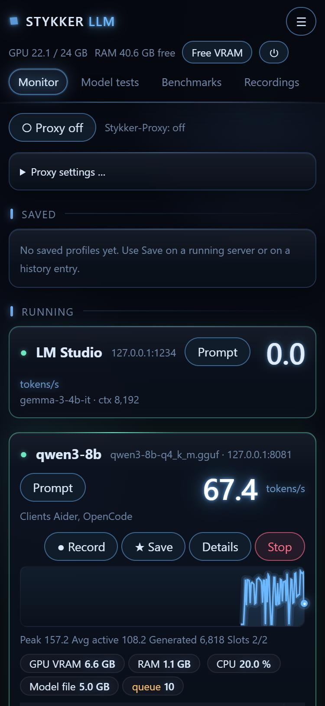

# StykkerLLM

[English](README.md) · **Deutsch**

Monitor und Schaltzentrale für lokale LLM-Server: **llama.cpp** (und Ableger), **Ollama**, **LM Studio** und **vLLM**.
StykkerLLM findet die Server auf deinem Rechner von selbst und zeigt, was sie gerade tun: Tokens pro Sekunde je Slot,
Kontext, VRAM, Anfragen-Log, Aufnahmen, Benchmarks und eine Testreihe für Modelle. Gesteuert wird im eigenen Fenster, in
jedem Browser oder auf dem Handy; im Terminal behältst du alles im Blick. Nichts verlässt deinen Rechner.


<details><summary>Spacepunk Titan (hell)</summary>


</details>

<sub>Alle Bilder zeigen den eingebauten Simulator: ausgedachte Server und Zahlen. Die Rangliste der Modelltests ist echt.</sub>

## Was es kann

- **Findet Server von selbst**: laufende llama.cpp-Server über die Befehlszeile des Prozesses, Ollama, LM Studio, dazu vLLM
  oder alles andere, was du per URL einträgst (auch in WSL und Docker).
- **Live-Ansicht**: Tokens/s je Slot, Prompt lesen oder schreiben, Kontextbalken, Warteschlange, eine leuchtende
  Verlaufskurve; die Karte leuchtet, solange ein Modell schreibt.
- **GPU und System**: Last, VRAM, Leistung, Temperatur, Takt, Drosselung, dazu VRAM und RAM **je Programm** als Balken.
  **Free VRAM** stoppt lokale llama.cpp-Server und entlädt Ollama-Modelle mit einem Klick.
- **Profile und Verlauf**: einen laufenden Server als Profil speichern und später wieder starten (mit Vorprüfung: Port frei,
  Modelldatei da, VRAM-Schätzung); auf Wunsch Neustart nach Absturz und Entladen nach Leerlauf.
- **Stykker-Proxy** auf Port 17500: ein OpenAI- und Anthropic-kompatibler Zugang für alle lokalen Modelle, andere PCs und
  Cloud-Anbieter. Er zählt Denken und Antwort, Tool-Aufrufe und Zeit bis zum ersten Token, aber nie Prompt-Texte.
- **Aufnahmen** mit Zeitleiste je Anfrage, Vergleich zweier Aufnahmen, Export als Markdown/CSV.
- **Benchmarks**: Kontext-Leiter, Tool-Test, parallele Anfragen, mit Warnung bei Rückschritten.
- **Modelltests**: Reihen *basic*, *hard*, *creative* und *agent* (das Modell arbeitet mit echten Werkzeugen in einem
  Wegwerf-Ordner), automatisch bewertet, Rangliste je Modell.
- **Prompt-Tester** an jedem geladenen Modell, mit Werkzeugen (lesen, auflisten, schreiben, bearbeiten, cmd/PowerShell);
  jeden Aufruf gibst du frei.
- **Model-Hosts**: andere PCs lassen nur Modelle laufen (StykkerHost, ein Tray-Symbol); der Server zeigt und steuert sie,
  sein Proxy startet ein angefragtes Modell auf dem Host, der die Datei hat und genug Platz.
- **Handy-Zugang**: sechsstelliger Code oder QR-Code, Rollen *Admin* und *Viewer*, Schalter Home/VPN – auch über Tailscale.
- **Fehlerbericht** mit einem Klick: Zip mit Protokollen und Stand, Geheimnisse geschwärzt, dazu ein vorausgefülltes
  GitHub-Issue.
- **Zwei Themen**: *Dark* mit weichem Leuchten und *Spacepunk Titan*, ein mattes helles Thema wie eine Schiffskonsole
  bei Arbeitslicht; *System* folgt Hell/Dunkel des Geräts. Symbole statt Wörter, `Ctrl+K` für jede Seite und Aktion.

| Modelltests | GPU-Details |
|---|---|
|  |  |

| Benchmarks |
|---|
|  |

## Ein Kern, drei Ansichten

| Programm | Was es ist |
|---|---|
| `StykkerUI.exe` | **Das App-Fenster.** Öffnet sofort mit Startbild, startet den Server bei Bedarf und zeigt die Weboberfläche ohne Browser. Braucht **keinen Grafikspeicher** (Zeichnen in Software). Beim Schließen fragt es: in den Tray, beenden oder abbrechen. |
| `StykkerLLM-Server.exe` | **Der Kern**: misst, startet und stoppt und liefert die Weboberfläche auf **http://127.0.0.1:8078** – für jeden Browser und das Handy. Selbst starten musst du ihn normalerweise nie. |
| `stykker.exe` | **Die Anzeige im Terminal**: GPU, System, laufende Server und die Web-Adresse auf einen Blick. Sie zeigt nur an; gesteuert wird in der Weboberfläche (Taste `w`). |


<table><tr>
<td width="30%"></td>
<td></td>
</tr><tr><td>Handy (kompakte Ansicht)</td><td>Terminal: <code>stykker</code>, Details eines Servers offen</td></tr></table>

**Der Server lebt, solange du ihn nutzt.** Jedes Fenster, jede Terminal-Anzeige und jeder offene Browser-Tab hält ihn am
Leben; wenige Sekunden nach dem letzten beendet er sich von selbst (außer ein Modelltest oder Benchmark läuft noch). Soll er
auch ohne Fenster weiterlaufen: **Einstellungen → Keep the server running** einschalten.

## Installation

Voraussetzung: **Windows 10 1809 oder neuer, x64**. Keine .NET-Laufzeit nötig. Das Fenster nutzt WebView2; das ist in
Windows 11 und aktuellen Windows-10-Installationen schon dabei.

1. `StykkerLLM-<version>-win-x64.zip` unter [Releases](https://github.com/CrimsonED1/Stykker-LLM/releases) herunterladen.
2. Irgendwohin entpacken (der Ordner ist portabel) und `StykkerUI.exe` starten.

*Später:* `winget install CrimsonED1.StykkerLLM` und `npm install -g stykker-llm`.

Das Programm ist nicht signiert. SmartScreen meldet vielleicht „Der Computer wurde durch Windows geschützt“: *Weitere
Informationen*, dann *Trotzdem ausführen*. Wenn sich zum ersten Mal ein anderes Gerät verbinden soll, fragt Windows, ob
`StykkerLLM-Server` ins Netz darf – für private Netzwerke zulassen. Den Download gegen `SHA256SUMS.txt` aus dem Release prüfen:

```powershell
(Get-FileHash .\StykkerLLM-0.3.1-win-x64.zip -Algorithm SHA256).Hash.ToLower()
```

## Schnellstart

1. Einen Server starten: `llama-server -m model.gguf --port 8081`, oder Ollama, oder LM Studio mit eingeschaltetem Server.
2. `StykkerUI.exe` öffnen. Nach wenigen Sekunden steht der Server da.
3. **Save** speichert ihn als Profil, **Prompt** spricht mit ihm, **Record** nimmt eine Zeitleiste auf, **Proxy** gibt deinen
   Coding-Tools einen einzigen Zugang.

## Die Anzeige im Terminal: stykker

`stykker` ist eine ruhige Live-Anzeige fürs Terminal, keine zweite Schaltzentrale. Sie zeigt GPU, System und die laufenden
Server mit Tokens/s, VRAM, Slots und Verlaufskurve, darunter die Web-Adresse – lokal, im Netz und über Tailscale. Läuft kein
Server, startet sie einen und hält ihn, solange sie offen ist.

| Taste | |
|---|---|
| `w` | Weboberfläche im Browser öffnen, schon angemeldet – dort wird alles gesteuert |
| `c` | Zugangscode und QR-Code fürs Handy |
| `r` | letzte Anfragen |
| `m` | VRAM und RAM je Programm |
| `↑` `↓` `Enter` | einen Server wählen und seine Details zeigen (Modell, URL, Slots, Kontext, Clients) |
| `?` | Hilfe · `Esc` schließt eine Tafel · `q` beendet |

Befehle, ganz ohne Optionen:

```text
stykker                    die Live-Anzeige
stykker status             dasselbe einmal (für Skripte und einen schnellen Blick)
stykker web                Weboberfläche im Browser öffnen, schon angemeldet
stykker stop               den Server beenden
stykker bugreport <text>   Fehlerbericht erstellen (siehe unten)
stykker help | version
```

## Handy und andere PCs

- **Schalter Home/VPN** (☰ → Phone access): aus = nur dieser PC, an = erreichbar im Netz, über VPN oder Tailscale.
- **Anmelden**: Das Handy scannt den QR-Code oder tippt den **sechsstelligen Code** ein (10 Minuten gültig, einmal). Den Code
  zeigen ☰ → Phone access und die Terminal-Anzeige (`c`). Oder das neue Gerät zeigt einen Code, und du gibst ihn auf einem
  schon angemeldeten Gerät frei.
- **Rollen**: *Admin* darf alles, *Viewer* nur zusehen (keine Aktionen, kein Zugangscode).
- **Model-Hosts** (☰ → Hosts): einen PC mit `StykkerHost.exe` per sechsstelligem Code koppeln, dann seine GPU sehen,
  seine Modelle starten und stoppen; der Proxy nutzt sie wie lokale. Siehe [docs/hosts.md](docs/hosts.md) (englisch).
- **Messwerte** für Statusleisten und Dashboards: `http://127.0.0.1:8078/api/metrics` (Prometheus-Text, nur dieser Rechner).

HTTPS gibt es noch nicht: im eigenen Netz oder über ein VPN wie Tailscale nutzen, nicht offen im Internet.

## Stykker-Proxy

- Ein lokaler Proxy auf Port **17500** (vorgegeben nur für diesen Rechner). Einschalten oben im Monitor.
- OpenAI-kompatible Clients (Qwen Code, Aider, …): `http://127.0.0.1:17500/v1`, Modell **`stykker`** oder ein Modell aus
  `/v1/models`. Anthropic-kompatible Clients (Claude Code, …): `http://127.0.0.1:17500`.
- `/v1/models` listet alle lokalen Modelle, die der gekoppelten Hosts (laufende und GGUF-Dateien, die bei der ersten Anfrage
  starten) und anderer Stykker-Rechner, dazu Cloud-Anbieter, die du
  mit Name, URL und Schlüssel einträgst (mit Windows-DPAPI gespeichert, nie wieder angezeigt). Das Feld `model` entscheidet,
  wohin eine Anfrage geht.
- Der Proxy reicht Anfragen unverändert durch und zählt nur Zahlen und Namen. Prompt- und Antworttexte werden nie gespeichert.

## Modelltests

*Model tests* in der Weboberfläche. Bereiche: **coding** (der Python-Code des Modells läuft nach Rückfrage gegen Tests in
einem Temp-Ordner; keine Sandbox), **reasoning**, **format**, **tools**, **long context**, **creative** und **agent**
(mehrstufige Aufgaben mit echten Datei- und Shell-Werkzeugen). Ergebnisse landen im Datenordner, die Rangliste ist je Modell.
Eigene Reihen: JSON-Dateien unter `eval\` im Datenordner.

## Protokolle und Fehlerberichte

Jedes Programm schreibt sein eigenes Protokoll (`StykkerLLM-Server.log`, `StykkerUI.log`, `stykker.log`) in `logs` neben dem
Programm, oder in den Datenordner, wenn der Programmordner schreibgeschützt ist. **☰ → Report a bug** (oder
`stykker bugreport <text>`) packt deine Beschreibung, die Protokolle, Einstellungen und den aktuellen Stand in ein Zip –
Schlüssel, Zugangscode, Geräte und Anbieter-Schlüssel sind nie dabei; API-Schlüssel, Tokens, dein Windows-Benutzername und der
PC-Name werden geschwärzt – und öffnet ein vorausgefülltes GitHub-Issue. Hochgeladen wird nichts: Das Zip hängst du selbst an.

## Daten und Datenschutz

- Alles liegt in `%APPDATA%\StykkerLLM\` (Einstellungen, Profile, Verlauf, Aufnahmen, Logs, Ergebnisse). Nichts verlässt den
  Rechner, außer Anfragen an einen Cloud-Anbieter, den du selbst einträgst.
- API-Schlüssel gestarteter Server (`--api-key`, `--hf-token`, …) werden nie gespeichert, angezeigt oder kopiert.
- Zugangscode, Geräte und Serverschlüssel sind an dein Windows-Konto gebunden (DPAPI). Von Geräte-Cookies wird nur ein Hash
  gespeichert.
- Eine gespeicherte Befehlszeile bestätigst du, bevor sie das erste Mal läuft und nach jeder Änderung.

## Selbst bauen

.NET 10 SDK unter Windows:

```bash
dotnet build StykkerLlm.slnx
dotnet test tests/StykkerLlm.Tests
```

Release-Zip: `powershell -ExecutionPolicy Bypass -File build\make-release.ps1 -Version 0.3.1`.

Debug-Builds haben Entwickler-Schalter, die nie in ein Release gelangen: `--sim` (simulierte Server, nichts Echtes wird
angefasst) für Server und `stykker`, `--data-dir <ordner>` und `--port <n>` für Fenster und `stykker`, und `--snapshot` für
Terminal-Bilder. Beispiel: `StykkerLLM-Server.exe --sim --stay --data-dir %TEMP%\stykker-sim --port 8090`.

Aufbau und Regeln für Mitwirkende (und Coding-Agenten): [AGENTS.md](AGENTS.md), [docs/architecture.md](docs/architecture.md),
[docs/ui.md](docs/ui.md) (englisch).

## Bekannte Grenzen

- Vorerst nur Windows. Der Server startet auch unter Linux, aber ohne automatische Erkennung und GPU-Werte; eine
  Linux-Plattform ist geplant.
- GPU-Werte brauchen eine NVIDIA-GPU (NVML).
- Ollama und LM Studio nur lesend (kein Stoppen, kein Speichern).
- Im Netz nur HTTP (siehe oben).
- Das Fenster scheitert sehr selten beim Öffnen (in Photino/WebView2); es öffnet sich dann von selbst neu.

## Mitmachen

Siehe [CONTRIBUTING.md](CONTRIBUTING.md). Sicherheitslücken: [SECURITY.md](SECURITY.md).

## Lizenz

[Business Source License 1.1](LICENSE) (BUSL-1.1): frei für private und nicht-kommerzielle Nutzung (privat, Ausbildung,
Forschung, gemeinnützig). Kommerzielle Nutzung braucht eine Lizenz vom Autor – bitte ein Issue öffnen. Jede Version wird vier
Jahre nach ihrer Veröffentlichung zu Apache-2.0.

## Spenden

<a href="https://www.paypal.me/crimsoned"></a>
