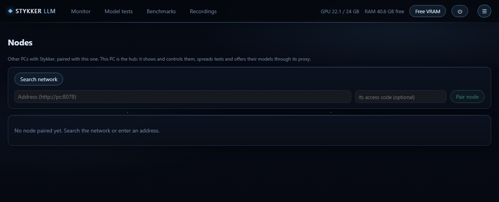

# StykkerLLM

**English** · [Deutsch](README.de.md)

A monitor and control center for local LLM servers: **llama.cpp** (and forks), **Ollama**, **LM Studio** and **vLLM**.
It finds the servers on your machine by itself and shows what they are doing right now: tokens per second per slot,
context use, VRAM, a request log, recordings, benchmarks and a model test suite. Use it in its own window, in any browser,
on your phone or in the terminal. Nothing leaves your machine.


<sub>All pictures show the built-in simulator (`--sim`): made-up servers and numbers. The model test ranking is real.</sub>

## What it does

- **Finds servers by itself**: running llama.cpp servers from the process command line, Ollama, LM Studio, and vLLM or
  anything else you add by URL (WSL and Docker included).
- **Live view**: tokens/s per slot, prompt reading vs. writing, context bar, queue, sparkline, a card that lights up while a
  model is writing.
- **GPU and system**: load, VRAM, power, temperature, clocks, throttling, and VRAM and RAM **per program** as a stacked bar.
  **Free VRAM** stops local llama.cpp servers and unloads Ollama models in one click.
- **Profiles and history**: save a running server as a profile and start it again later (pre-checks: port free, model file
  exists, VRAM estimate); optional restart after a crash and unload after idle time.
- **Stykker-Proxy** on port 17500: one OpenAI- and Anthropic-compatible endpoint for all local models, other PCs and cloud
  providers. It counts thinking vs. answer, tool calls and time to first token, never prompt texts.
- **Recordings** with a timeline per request, compare two recordings, Markdown/CSV export.
- **Benchmarks**: context ladder, tool call test, parallel requests, with a regression alert.
- **Model tests**: suites *basic*, *hard*, *creative* and *agent* (the model works with real tools in a throwaway folder),
  scored automatically, ranked per model.
- **Prompt tester** on every loaded model, with tools (read, list, write, edit, cmd/PowerShell), each call approved by you.
- **Nodes**: pair other PCs running StykkerLLM, see their servers and spread model tests over them.
- **Phone access**: six-digit code or QR code, roles *Admin* and *Viewer*, Home/VPN switch.
- **Five themes**: Deep Sea, Cyber Grid, Space Glass, Obsidian, Phosphor.

| Model tests | GPU details |
|---|---|
|  |  |

| Benchmarks | Nodes |
|---|---|
|  |  |

## Three ways to use it

| Program | What it is |
|---|---|
| `StykkerUI.exe` | The app window. It starts the server if needed and shows the web interface without a browser. It uses **no GPU memory** (0 MB VRAM, rendering in software). Closing asks: keep it in the tray, quit, or cancel. |
| `StykkerLLM-Server.exe` | The core: it measures and serves the web interface on **http://127.0.0.1:8078**. Open it in any browser or on your phone. |
| `stykker.exe` | The terminal side: one-shot commands (`stykker status`, `stykker start`, `stykker eval …`) and a full TUI. |


<table><tr>
<td width="30%"></td>
<td></td>
</tr><tr><td>Phone (compact view)</td><td>Terminal: <code>stykker</code></td></tr></table>

All three act on the same server: one process measures, every interface shows the same state and the same buttons.
The server runs only while you use it: it ends by itself a few seconds after the last window, terminal or web page closes
(unless a model test is running). For a PC that other PCs use as a node, turn on *Keep the server running* in the
settings or start it with `stykker server start`.

## Install

Requirements: **Windows 10 1809 or newer, x64**. No .NET runtime needed. The window uses WebView2, which is part of Windows 11
and of current Windows 10 installations.

1. Download `StykkerLLM-<version>-win-x64.zip` from [Releases](https://github.com/CrimsonED1/Stykker-LLM/releases).
2. Unzip it anywhere (the folder is portable) and start `StykkerUI.exe`.

*Coming later:* `winget install CrimsonED1.StykkerLLM` and `npm install -g stykker-llm`.

The program is not code-signed. Windows SmartScreen may say "Windows protected your PC": choose *More info*, then
*Run anyway*. Check the download against `SHA256SUMS.txt` from the release:

```powershell
(Get-FileHash .\StykkerLLM-0.3.1-win-x64.zip -Algorithm SHA256).Hash.ToLower()
```

## Quick start

1. Start a server: `llama-server -m model.gguf --port 8081`, or Ollama, or LM Studio with its server on.
2. Open `StykkerUI.exe`. The server shows up within a few seconds.
3. **Save** it as a profile, **Prompt** to talk to it, **Record** for a timeline, **Proxy** to give your coding tools one
   endpoint.

No server at hand? Try the simulator:

```bash
stykker sim
```

or `StykkerLLM-Server.exe --sim --data-dir <empty folder>` for the web interface with simulated servers. The simulator
never touches real servers or your data folder.

## Phone and other PCs

- **Home/VPN switch** (☰ → Phone access, or `stykker remote on|off`): off = only this PC, on = reachable in your network.
- **Sign in**: the phone scans the QR code or types the **six-digit code** (valid 10 minutes, once). Or the new device shows a
  code and you approve it on a device that is already signed in (☰ → Phone access, or `stykker approve <code>`).
- **Roles**: *Admin* may do everything, *Viewer* only looks (no actions, no access code).
- **Nodes** (☰ → Nodes): search the network, pair another PC with its code, then see its servers, start and stop them,
  and run model tests on it. Its models also appear in your Stykker-Proxy as `node/model`. See [docs/nodes.md](docs/nodes.md).
- **Metrics** for status bars and dashboards: `http://127.0.0.1:8078/api/metrics` (Prometheus text, this machine only).

There is no HTTPS yet: use it in your own network or over a VPN, not on the open internet.

## Stykker-Proxy

- One local proxy on port **17500** (loopback by default). Switch it on at the top of the monitor.
- OpenAI-compatible clients (Qwen Code, Aider, …): `http://127.0.0.1:17500/v1`, model **`stykker`** or any model from
  `/v1/models`. Anthropic-compatible clients (Claude Code, …): `http://127.0.0.1:17500`.
- `/v1/models` lists all local models, the models of paired nodes and other Stykker machines, and cloud providers you add
  with name, URL and key (stored with Windows DPAPI, never shown again). Requests are routed by the `model` field.
- The proxy forwards requests unchanged and only counts numbers and names. Prompt and answer texts are never stored.

## Model tests

`stykker eval <server|port|url>`, or *Model tests* in the web interface. Categories: **coding** (the model's Python is run
against tests in a temporary folder, after asking; not a sandbox), **reasoning**, **format**, **tools**, **long context**,
**creative**, and **agent** (multi-step tasks with real file and shell tools). Results are saved in the data folder and
ranked per model; runs can be spread over paired nodes. Own suites: JSON files under `eval\` in the data folder.

## Logs and bug reports

Each program writes its own log (`StykkerLLM-Server.log`, `StykkerUI.log`, `stykker.log`) to `logs` next to the program,
or to the data folder when the program folder is read-only. **☰ → Report a bug** (or `stykker bugreport <text>`) packs
your description, the logs, settings and current state into a zip – keys, the access code, devices and provider keys are
never included; API keys, tokens, your Windows user name and the PC name are blacked out – and opens a prefilled GitHub
issue. Nothing is uploaded automatically: you attach the zip yourself.

## Data and privacy

- Everything lives in `%APPDATA%\StykkerLLM\` (settings, profiles, history, recordings, logs, results). Nothing leaves the
  machine, except requests to a cloud provider you add yourself.
- API keys of started servers (`--api-key`, `--hf-token`, …) are never stored, shown or copied.
- Access code, devices and the server key are bound to your Windows account (DPAPI). Only a hash of each device cookie is
  stored.
- A saved command line is confirmed before it runs the first time and after every change.

## Build from source

.NET 10 SDK on Windows:

```bash
dotnet build StykkerLlm.slnx
dotnet test tests/StykkerLlm.Tests
```

Release zip: `powershell -ExecutionPolicy Bypass -File build\make-release.ps1 -Version 0.3.1`.
Layout and rules for contributors (and coding agents): [AGENTS.md](AGENTS.md), [docs/architecture.md](docs/architecture.md),
[docs/ui.md](docs/ui.md).

## Known limitations

- Windows only for now. The server and `stykker` start on Linux too, but without automatic detection and GPU values; a
  Linux platform layer is planned.
- GPU values need an NVIDIA GPU (NVML).
- Ollama and LM Studio are read-only (no stop, no save).
- Plain HTTP in the network (see above).

## Contributing

See [CONTRIBUTING.md](CONTRIBUTING.md). Security issues: [SECURITY.md](SECURITY.md).

## License

[Business Source License 1.1](LICENSE) (BUSL-1.1): free for personal and non-commercial use (private, education, research,
non-profit). Commercial use needs a license from the author – open an issue. Each version becomes Apache-2.0 four years
after its release.

## Donate

<a href="https://www.paypal.me/crimsoned"></a>
