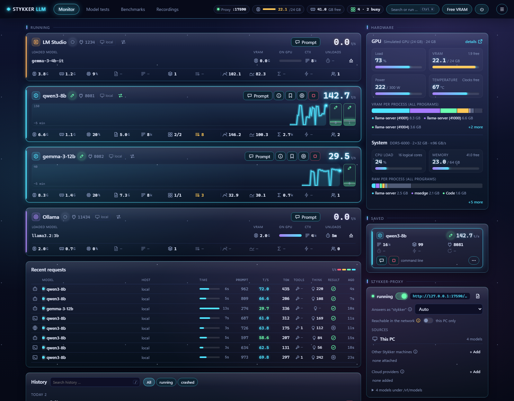
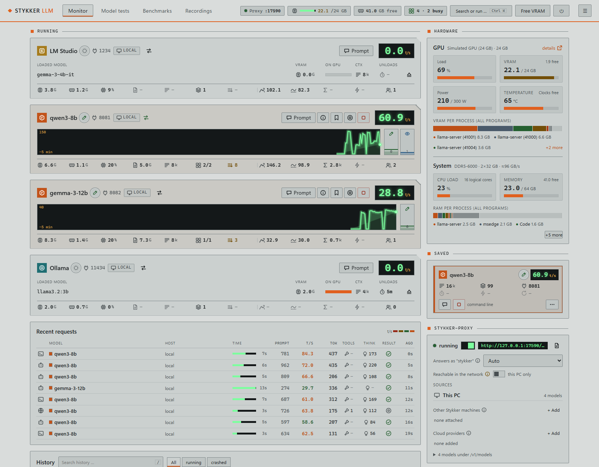
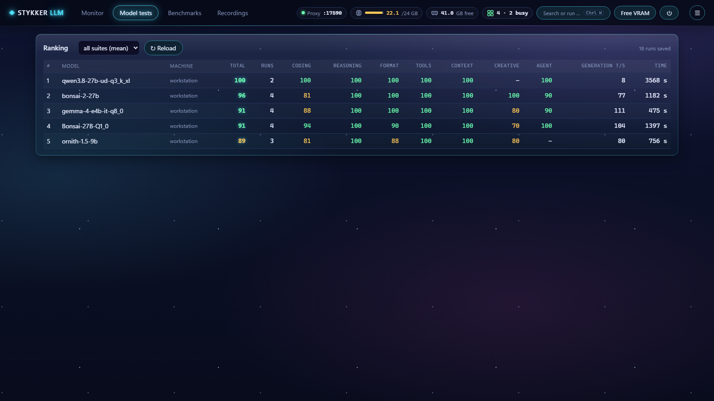
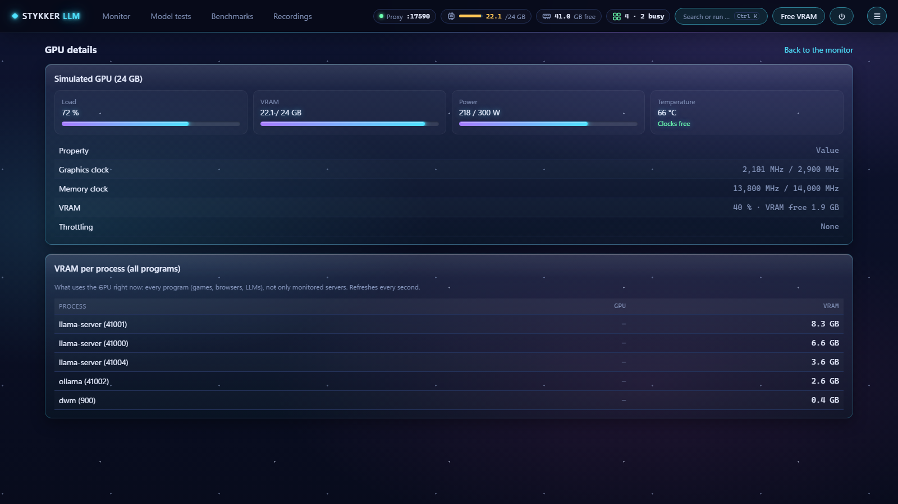
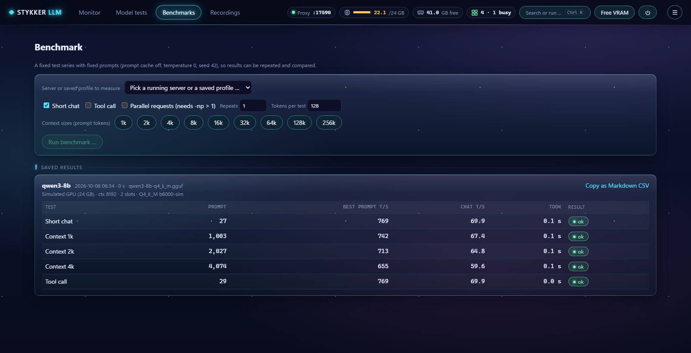
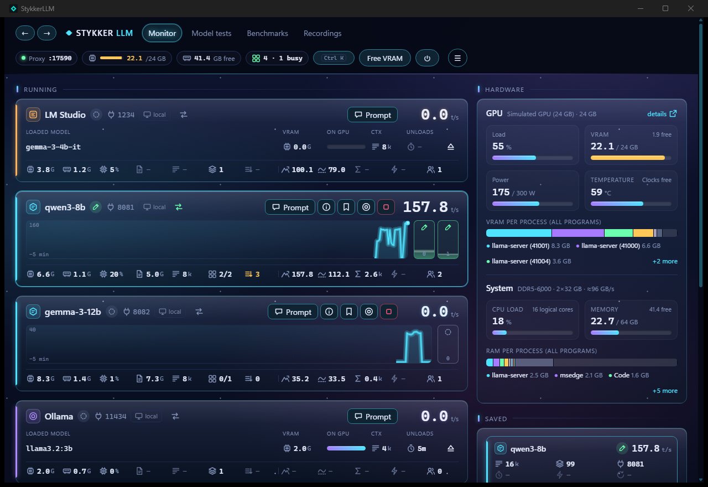
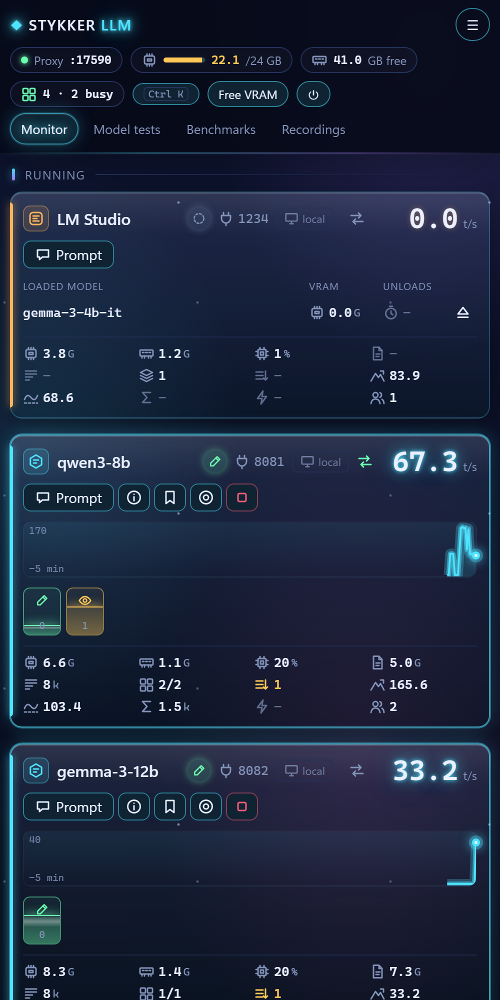
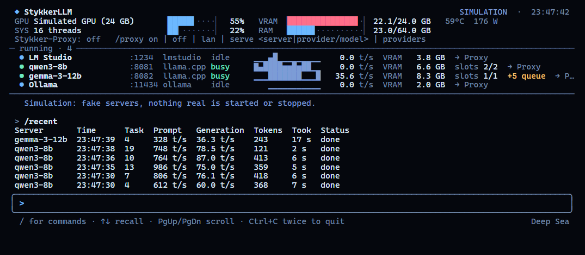

# StykkerLLM

**English** · [Deutsch](README.de.md)

A monitor and control center for local LLM servers: **llama.cpp** (and forks), **Ollama**, **LM Studio** and **vLLM**.
It finds the servers on your machine by itself and shows what they are doing right now: tokens per second per slot,
context use, VRAM, a request log, recordings, benchmarks and a model test suite. Control everything from its own window,
any browser or your phone; keep an eye on it in the terminal. Nothing leaves your machine.



<details><summary>Spacepunk Titan (light)</summary>



</details>

<sub>All pictures show the built-in simulator: made-up servers and numbers. The model test ranking is real.</sub>

## What it does

- **Finds servers by itself**: running llama.cpp servers from the process command line, Ollama, LM Studio, and vLLM or
  anything else you add by URL (WSL and Docker included).
- **Live view**: tokens/s per slot, prompt reading vs. writing, context bar, queue, a glowing sparkline, a card that lights
  up while a model is writing.
- **GPU and system**: load, VRAM, power, temperature, clocks, throttling, and VRAM and RAM **per program** as a stacked bar.
  **Free VRAM** stops local llama.cpp servers and unloads Ollama models in one click.
- **Profiles and history**: save a running server as a profile and start it again later (pre-checks: port free, model file
  exists, VRAM estimate); optional restart after a crash and unload after idle time.
- **Stykker-Proxy** on port 17500: one OpenAI- and Anthropic-compatible endpoint for all local models, other PCs and cloud
  providers. It counts thinking vs. answer, tool calls and time to first token, never prompt texts.
- **Recordings** with a timeline per request, compare two recordings, Markdown/CSV export.
- **Benchmarks**: context ladder, tool call test, parallel requests, with a regression alert.
- **Model tests**: suites *basic*, *hard*, *creative* and *agent* (the model works with real tools in a throwaway folder),
  scored automatically, ranked per model.
- **Prompt tester** on every loaded model, with tools (read, list, write, edit, cmd/PowerShell), each call approved by you.
- **Model hosts**: other PCs run only models (StykkerHost, a tray icon); the server shows and controls them, and its
  proxy starts a requested model on the host that has the file and room for it.
- **Phone access**: six-digit code or QR code, roles *Admin* and *Viewer*, Home/VPN switch – works over Tailscale too.
- **Bug report** in one click: a zip with logs and state, secrets blacked out, plus a prefilled GitHub issue.
- **Two themes**: *Dark* with a soft glow and *Spacepunk Titan*, a matte light theme like a ship console under work
  light; *System* switches with the light/dark setting of the device. Symbols instead of words, `Ctrl+K` for every page
  and action.

| Model tests | GPU details |
|---|---|
|  |  |

| Benchmarks |
|---|
|  |

## One core, three views

| Program | What it is |
|---|---|
| `StykkerUI.exe` | **The app window.** Opens at once with a start screen, starts the server if needed and shows the web interface without a browser. Uses **no GPU memory** (rendering in software). Closing asks: keep it in the tray, quit, or cancel. |
| `StykkerLLM-Server.exe` | **The core**: measures, starts and stops, and serves the web interface on **http://127.0.0.1:8078** – for any browser and your phone. You normally never start it yourself. |
| `stykker.exe` | **The terminal display**: GPU, system, running servers and the web address at a glance. It only shows; everything is controlled in the web interface (press `w`). |



<table><tr>
<td width="30%"></td>
<td></td>
</tr><tr><td>Phone (compact view)</td><td>Terminal: <code>stykker</code>, details of a server open</td></tr></table>

**The server lives as long as you use it.** Every window, terminal display and open web page keeps it alive; a few seconds
after the last one closes it ends by itself (unless a model test or benchmark is still running). To keep it up without any
window, turn on **Settings → Keep the server running**.

## Install

Requirements: **Windows 10 1809 or newer, x64**. No .NET runtime needed. The window uses WebView2, which is part of Windows 11
and of current Windows 10 installations.

1. Download `StykkerLLM-<version>-win-x64.zip` from [Releases](https://github.com/CrimsonED1/Stykker-LLM/releases).
2. Unzip it anywhere (the folder is portable) and start `StykkerUI.exe`.

*Coming later:* `winget install CrimsonED1.StykkerLLM` and `npm install -g stykker-llm`.

The program is not code-signed. Windows SmartScreen may say "Windows protected your PC": choose *More info*, then
*Run anyway*. The first time another device should connect, Windows asks whether `StykkerLLM-Server` may use the network –
allow it for private networks. Check the download against `SHA256SUMS.txt` from the release:

```powershell
(Get-FileHash .\StykkerLLM-0.3.1-win-x64.zip -Algorithm SHA256).Hash.ToLower()
```

## Quick start

1. Start a server: `llama-server -m model.gguf --port 8081`, or Ollama, or LM Studio with its server on.
2. Open `StykkerUI.exe`. The server shows up within a few seconds.
3. **Save** it as a profile, **Prompt** to talk to it, **Record** for a timeline, **Proxy** to give your coding tools one
   endpoint.

## The terminal display: stykker

`stykker` is a quiet live display for a terminal window, not a second control panel. It shows GPU, system and the running
servers with tokens/s, VRAM, slots and a sparkline, and below them the web address – local, in your network and over
Tailscale. If no server is running, it starts one and keeps it alive while it is open.

| Key | |
|---|---|
| `w` | open the web interface in the browser, already signed in – everything is controlled there |
| `c` | access code and QR code for the phone |
| `r` | recent requests |
| `m` | VRAM and RAM per program |
| `↑` `↓` `Enter` | pick a server and show its details (model, URL, slots, context, clients) |
| `?` | help · `Esc` closes a panel · `q` quits |

Commands, without any options:

```text
stykker                    the live display
stykker status             the same once (for scripts and a quick look)
stykker web                open the web interface in the browser, signed in
stykker stop               shut the server down
stykker bugreport <text>   create a bug report (see below)
stykker help | version
```

## Phone and other PCs

- **Home/VPN switch** (☰ → Phone access): off = only this PC, on = reachable in your network, over a VPN or Tailscale.
- **Sign in**: the phone scans the QR code or types the **six-digit code** (valid 10 minutes, once). The code is in
  ☰ → Phone access and in the terminal display (`c`). Or the new device shows a code and you approve it on a device that is
  already signed in.
- **Roles**: *Admin* may do everything, *Viewer* only looks (no actions, no access code).
- **Model hosts** (☰ → Hosts): pair a PC running `StykkerHost.exe` with a six-digit code, then see its GPU, start and
  stop its models; the proxy uses them like local ones. See [docs/hosts.md](docs/hosts.md).
- **Metrics** for status bars and dashboards: `http://127.0.0.1:8078/api/metrics` (Prometheus text, this machine only).

There is no HTTPS yet: use it in your own network or over a VPN such as Tailscale, not on the open internet.

## Stykker-Proxy

- One local proxy on port **17500** (loopback by default). Switch it on at the top of the monitor.
- OpenAI-compatible clients (Qwen Code, Aider, …): `http://127.0.0.1:17500/v1`, model **`stykker`** or any model from
  `/v1/models`. Anthropic-compatible clients (Claude Code, …): `http://127.0.0.1:17500`.
- `/v1/models` lists all local models, the models of paired hosts (running ones and GGUF files that start on the first
  request) and other Stykker machines, and cloud providers you add
  with name, URL and key (stored with Windows DPAPI, never shown again). Requests are routed by the `model` field.
- The proxy forwards requests unchanged and only counts numbers and names. Prompt and answer texts are never stored.

## Model tests

*Model tests* in the web interface. Categories: **coding** (the model's Python is run against tests in a temporary folder,
after asking; not a sandbox), **reasoning**, **format**, **tools**, **long context**, **creative**, and **agent** (multi-step
tasks with real file and shell tools). Results are saved in the data folder and ranked per model. Own suites: JSON files under `eval\` in the data folder.

## Logs and bug reports

Each program writes its own log (`StykkerLLM-Server.log`, `StykkerUI.log`, `stykker.log`) to `logs` next to the program,
or to the data folder when the program folder is read-only. **☰ → Report a bug** (or `stykker bugreport <text>`) packs
your description, the logs, settings and current state into a zip – keys, the access code, devices and provider keys are
never included; API keys, tokens, your Windows user name and the PC name are blacked out – and opens a prefilled GitHub
issue. Nothing is uploaded automatically: you attach the zip yourself.

## Data and privacy

- Everything lives in `%APPDATA%\StykkerLLM\` (settings, profiles, history, recordings, logs, results). Nothing leaves the
  machine, except requests to a cloud provider you add yourself.
- API keys of started servers (`--api-key`, `--hf-token`, …) are never stored, shown or copied.
- Access code, devices and the server key are bound to your Windows account (DPAPI). Only a hash of each device cookie is
  stored.
- A saved command line is confirmed before it runs the first time and after every change.

## Build from source

.NET 10 SDK on Windows:

```bash
dotnet build StykkerLlm.slnx
dotnet test tests/StykkerLlm.Tests
```

Release zip: `powershell -ExecutionPolicy Bypass -File build\make-release.ps1 -Version 0.3.1`.

Debug builds have developer options that never ship in a release: `--sim` (simulated servers, nothing real is touched) for
the server and `stykker`, `--data-dir <folder>` and `--port <n>` for the window and `stykker`, and `--snapshot` for
terminal pictures. Example: `StykkerLLM-Server.exe --sim --stay --data-dir %TEMP%\stykker-sim --port 8090`.

Layout and rules for contributors (and coding agents): [AGENTS.md](AGENTS.md), [docs/architecture.md](docs/architecture.md),
[docs/ui.md](docs/ui.md).

## Known limitations

- Windows only for now. The server starts on Linux too, but without automatic detection and GPU values; a Linux platform
  layer is planned.
- GPU values need an NVIDIA GPU (NVML).
- Ollama and LM Studio are read-only (no stop, no save).
- Plain HTTP in the network (see above).
- The window very rarely fails while opening (inside Photino/WebView2); it then opens again by itself.

## Contributing

See [CONTRIBUTING.md](CONTRIBUTING.md). Security issues: [SECURITY.md](SECURITY.md).

## License

[Business Source License 1.1](LICENSE) (BUSL-1.1): free for personal and non-commercial use (private, education, research,
non-profit). Commercial use needs a license from the author – open an issue. Each version becomes Apache-2.0 four years
after its release.

## Donate

<a href="https://www.paypal.me/crimsoned"></a>
