# Stykker-NanoCut

C# library for material removal and penetration in 2D and 3D with an accuracy below 0.1 µm.
Pure managed C# on .NET 10, also runs on `browser-wasm`, no runtime dependencies.
Background, research and phase plan: [docs/plan.md](docs/plan.md) (German).

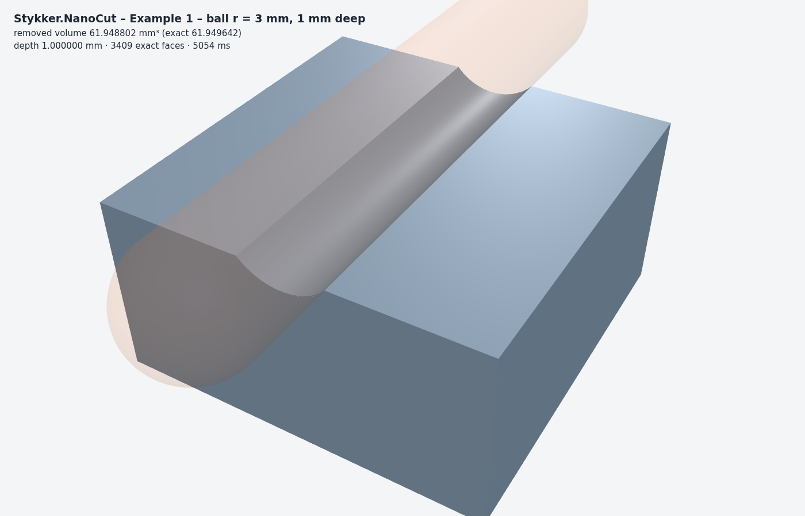

## Status

| Phase | Scope | Status |
| --- | --- | --- |
| 0 – Repo & CI | Project structure, GitHub Actions for `net10.0` and `browser-wasm`, license | ✅ |
| 1 – Core | 1 nm grid, `Int128` predicates, `Int384`, planes and homogeneous intersection points, tolerance model | ✅ predicates match `BigInteger` on 10⁶ cases, bit budget verified ([docs/bit-budget.md](docs/bit-budget.md)) |
| 2 – 2D kernel | Booleans (4 fill rules, hot-pixel snap rounding), arcs with chord error, offset, Minkowski sweep, triangulation and convex decomposition | ✅ example 1 (2D) within budget, oracle vs. Clipper2 on 10,000 random polygons |
| 3 – 3D kernel | Plane-based exact Booleans, BVH, primitives, extrude/revolve, convex hull, lossless `.ncs` format, STL import | ✅ Steinmetz solid and sphere lens within budget, oracle vs. ManifoldSharp (max. ΔV 4·10⁻¹⁴ mm³) |
| 4 – Processes | Acting shape + motion on one or more workpieces: planar processes (gear generation), turning, 3D milling ([docs/processes.md](docs/processes.md)) | ✅ 2D/turning/3D translation; 3D rotation works but slow |
| 5 – Web | three.js/Babylon.js adapters, byte-buffer interop, Blazor WebAssembly demo with machines ✅; web worker, AOT build in CI | mostly |
| 6 – Hardening & release | Fuzzing, benchmarks, packages | open |

Open features: [docs/todo.md](docs/todo.md).

| | |
| --- | --- |
| 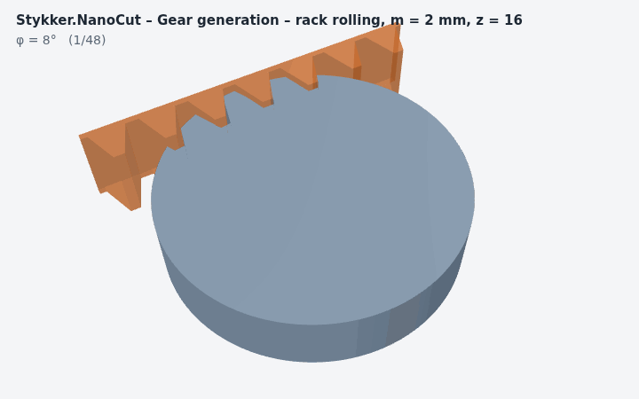 | 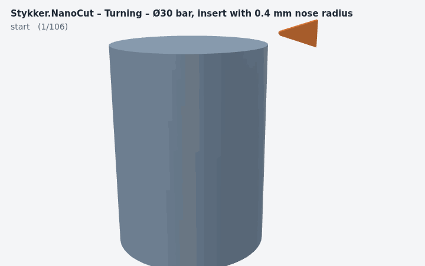 |
| 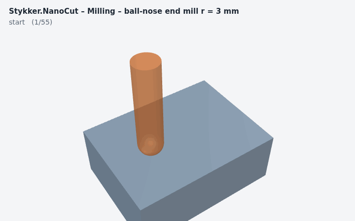 | 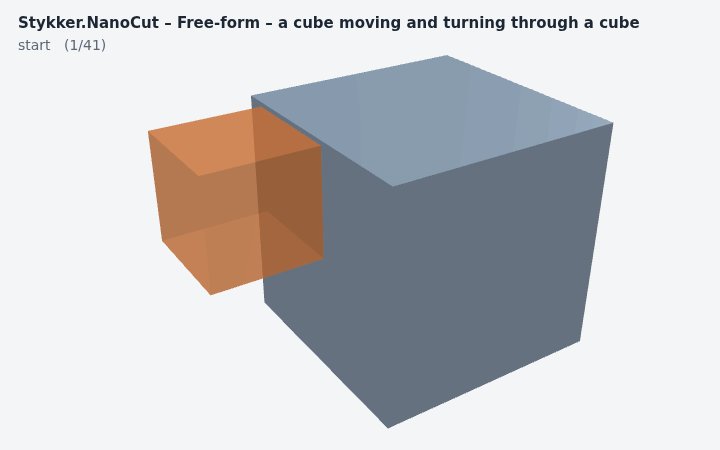 |
| 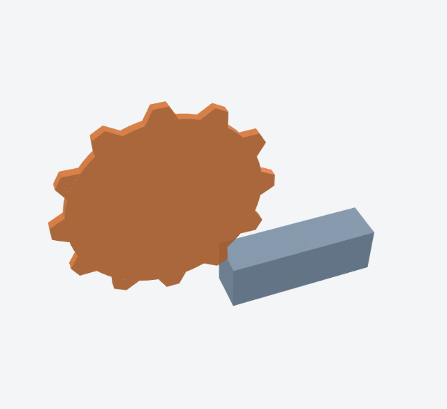 | 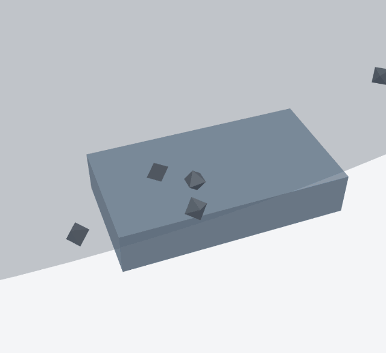 |

## Interactive demo

`samples/Stykker.NanoCut.Demo` is a Blazor WebAssembly app: all geometry is computed in the browser in C# and shown
with three.js or Babylon.js (switchable).

- **Reference cases, kernels, shapes, processes:** every scene has editable parameters, live metrics, PASS/FAIL checks
  against analytic solutions, and STL / `.ncs` download.
- **Machines:** a lathe (X diameter, Z) and a 3-axis mill (X, Y, Z) with jog buttons (0.01 … 5 mm, infeed), go-to,
  undo and a G-code program (G0/G1). Every move cuts exactly; rapid moves into material are reported as collisions.
- **Spinning disc:** a saw blade or cut-off wheel at 3000 rpm fed into a block; the cut is computed in real process time
  (teeth on their trochoids, feed per tooth, removed volume) and played back in slow motion (1/10 … 1/1000).
- **Grinding grains:** a wheel with random abrasive grains (size, protrusion mean/σ, seed); every grain follows its
  trochoid and cuts its own chip – active grains in orange, chip-thickness histogram, surface profile with Ra/Rz.
- **Profiles:** sections of 3D parts over a range you define – any plane with a u/v window, the r–z profile of a turned
  part at an angle φ with z and r ranges (plus the envelope over all angles), the radius around the axis, or a line profile
  with Ra/Rz; deviation from the nominal contour and CSV / SVG export.
- **Free-form:** two cubes – drag or rotate the tool cube with a gizmo (or jog X/Y/Z/A/B/C); every motion,
  translation and rotation together, cuts the other solid.
- **Self test:** runs the reference checks of the test suite inside the browser.

```bash
cd samples/Stykker.NanoCut.Demo && dotnet run          # then open the printed URL
dotnet publish -c Release                              # static site in bin/Release/net10.0/publish/wwwroot
```

GitHub Pages: enable *Settings → Pages → Source: GitHub Actions* and run the "Demo (GitHub Pages)" workflow.
The app runs in the .NET interpreter by default; the Pages workflow publishes with AOT (`-p:Aot=true`, needs
`dotnet workload install wasm-tools`), which is about 5× faster for heavy scenes. Rotations in the free-form page take
well under a second per 45° at the default path error (see the performance notes in docs/processes.md).

| | |
| --- | --- |
| 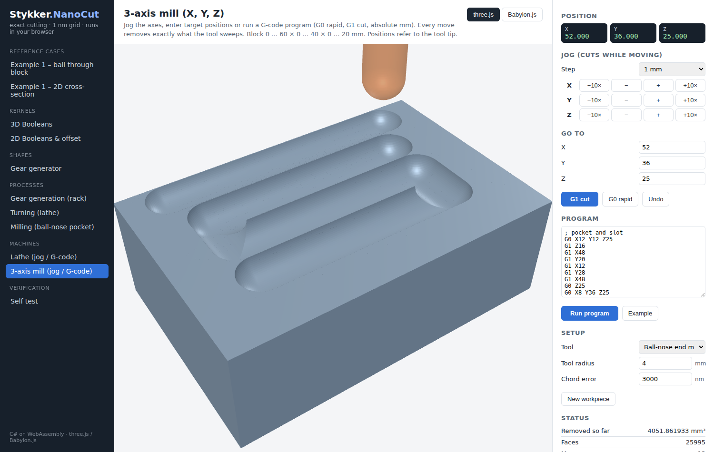 | 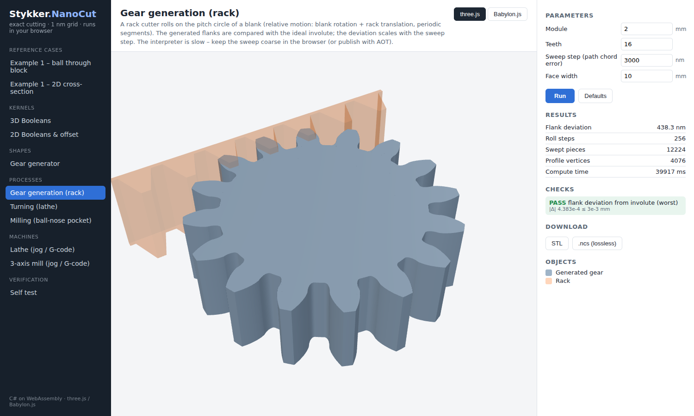 |
| 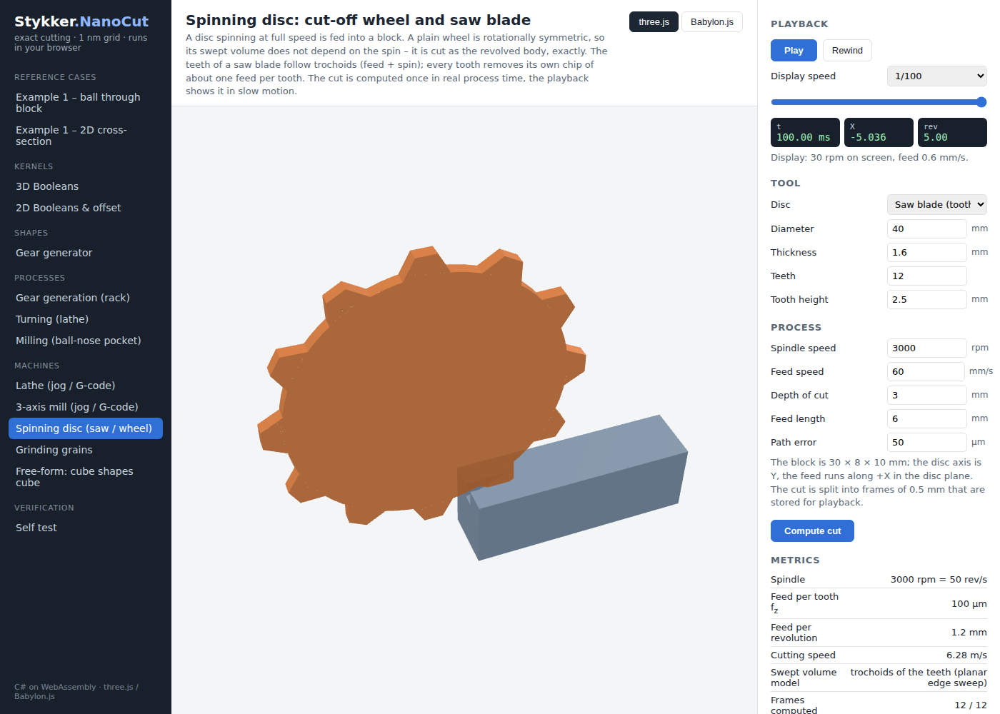 | 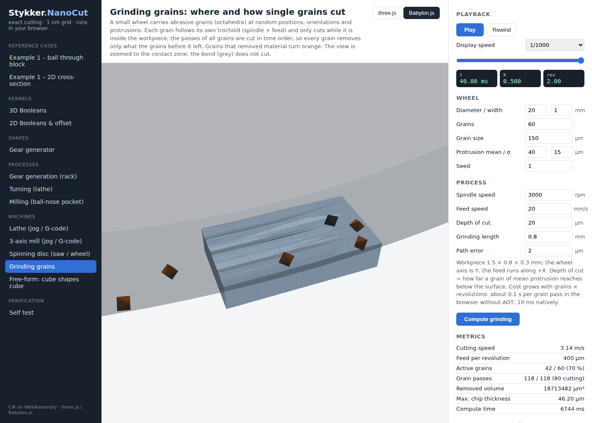 |
| 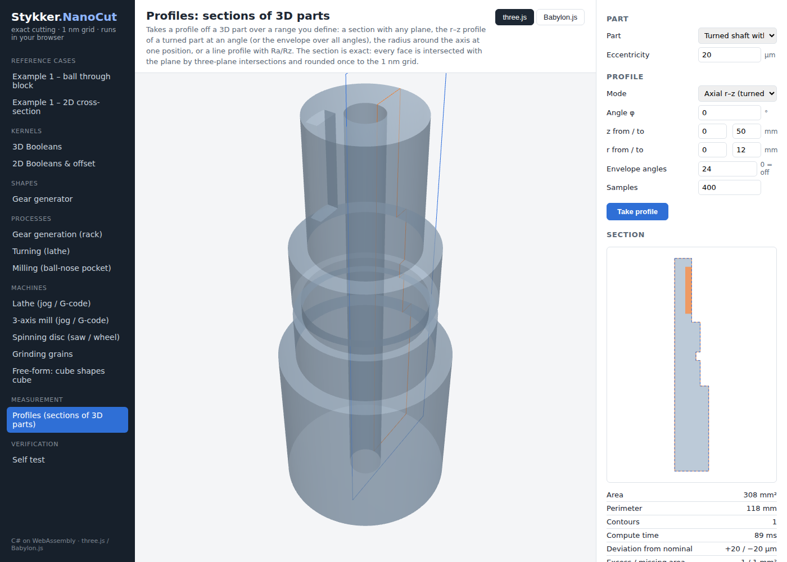 | 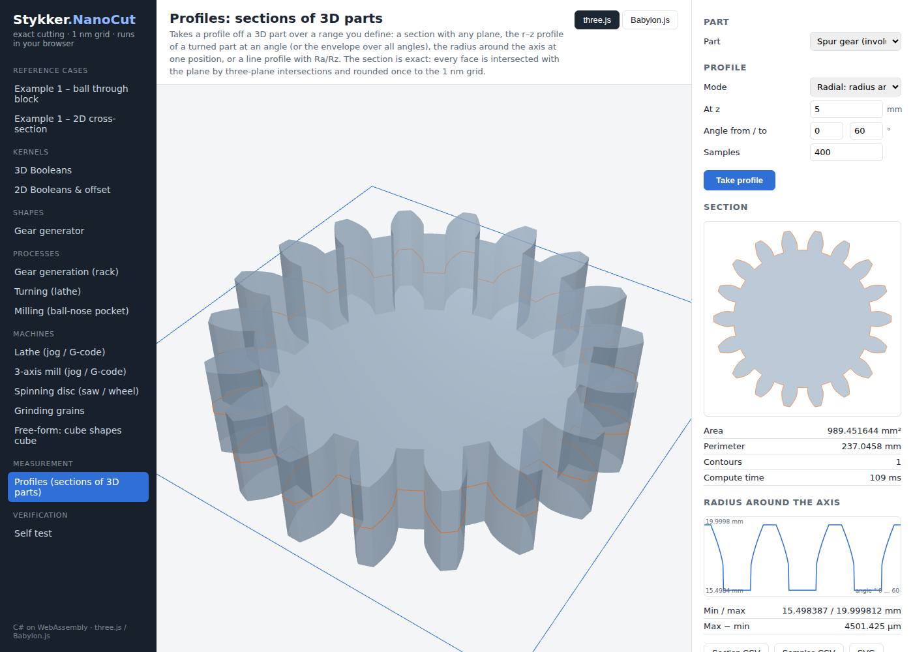 |

## Quick start (2D)

```csharp
using Stykker.NanoCut;
using Stykker.NanoCut.Geometry2D;
using Stykker.NanoCut.Cutting;

var tol = Tolerance.Budget(totalUm: 0.1, chordNm: 50);

var rect = Region2.Rectangle(Vec2.Mm(0, 0), Vec2.Mm(20, 10), tol);
var circ = Region2.Circle(Vec2.Mm(10, 12), radiusMm: 3, tol);
double cutArea = (rect & circ).AreaMm2;     // 3.09732 (exact 3.097482, deviation 1.7e-4 ≤ 5.0e-4)
Region2 rest2D = rect - circ;

// Material removal along a path
var result = Cutter2.Cut(rect, Tool2.Circle(3), ToolPath2.Linear(Vec2.Mm(-5, 12), Vec2.Mm(25, 12)), tol);
Console.WriteLine(result.RemovedAreaMm2);   // 20.000000
Console.WriteLine(result.MaxDepthMm);       // 1.000000

float[][] lines = rest2D.ToPolylines();     // for three.js LineLoop / Babylon.js CreateLines
```

## Quick start (3D)

```csharp
using Stykker.NanoCut;
using Stykker.NanoCut.Geometry3D;
using Stykker.NanoCut.Cutting;

var tol   = Tolerance.Budget(totalUm: 0.1, chordNm: 50);
var stock = Solid.Box(Vec3.Mm(0, 0, 0), Vec3.Mm(20, 20, 10), tol);
var tool  = Tool.Ball(radiusMm: 3);
var path  = ToolPath.Linear(Vec3.Mm(-5, 10, 12), Vec3.Mm(25, 10, 12));

CutResult r = Cutter.Cut(stock, tool, path, tol);
Console.WriteLine(r.RemovedVolumeMm3);      // 61.948802 (exact 61.949642, |Δ| 8.4e-4 ≤ 0.0101)
Console.WriteLine(r.MaxDepthMm);            // 1.000000

MeshBuffers buf = r.Remaining.ToMeshBuffers(OriginMode.Centroid);   // → three.js / Babylon.js
r.Remaining.Save("part.ncs");                                        // lossless internal format
```

## Profiles from 3D parts

```csharp
using Stykker.NanoCut.Geometry2D;
using Stykker.NanoCut.Geometry3D;

var axis = (0.0, 0.0, 1.0);
// r–z profile at φ = 30°, only z 10…40 mm and r ≤ 12 mm (u = radius, v = z)
Region2 rz = Section3.Axial(part, Vec3.Mm(0, 0, 0), axis, Math.PI / 6, z0Mm: 10, z1Mm: 40, r1Mm: 12);
double[] radius = Profile2.Radii(rz, 10, 40, samples: 300);         // outer radius along z
var (outer, inner, _) = Section3.AxialEnvelope(part, Vec3.Mm(0, 0, 0), axis, 36, 10, 40);   // run-out
var dev = Profile2.Deviation(rz, nominalProfile);                    // max excess / shortfall, exact areas

Region2 cut = Section3.Cut(part, SectionPlane.XZ(5), u0Mm: 0, u1Mm: 20, v0Mm: -5, v1Mm: 5);  // any plane, windowed
double[] h = Section3.LineProfile(part, Vec3.Mm(0, 5, 0), Vec3.Mm(40, 5, 0), (0, 0, 1), 1000);
var (ra, rz2) = Profile2.Roughness(h);
File.WriteAllText("rz.csv", Profile2.ToCsv(rz));
```

The section is exact: each face is intersected with the plane by three-plane intersections and the points are rounded
once to the nm grid of the plane's (u, v) frame. A face lying in the section plane counts as just below it.

## Performance

The kernel is exact and still fast on long tasks. pocket-large, an 80 × 60 × 20 mm zig-zag pocket cut by 876 ball-hull
steps on a 4-core container:

| Engine | Time | Result triangles |
| --- | ---: | ---: |
| **NanoCut** (C#, exact) | **4.9 s** | 698 |
| Manifold (C++, double, TBB) | 8.2 s | 23 774 |
| CGAL (C++, exact) | 347 s | 88 872 |

Short tasks (16–96 steps) remain 1.3–2.3× faster with C++. Results are identical to 1e-10 mm³.

```csharp
Solid.MaxParallelism = Environment.ProcessorCount;      // threads for the 3D kernel; results do not depend on it
var part = Solid.SubtractInOrder(block, toolFactories); // cut chain: next tool built while the current one is cut
var swept = Solid.UnionAll(pieces);                     // balanced, parallel union
```

The benchmark (`bench/`, NanoCut vs Manifold C++/C# and CGAL on identical nm-grid scenes), the optimisation rounds and
how they were verified are described in [docs/performance.md](docs/performance.md) and
[bench/README.md](bench/README.md).

A GPU is used for previews, not for the exact result. `src/Stykker.NanoCut.Gpu` previews a whole toolpath as a Z-map
(one height per grid cell) with two interchangeable backends: `Cpu` in plain C#, and `Cuda` on an optional native
kernel. On an RTX 5070 Ti the 876-step pocket-large previews in 2.5 ms wall against 4.66 s for the exact kernel; the CPU
backend alone needs 286 ms and runs everywhere, CI and browser included. The preview deviates by 0.106 %, almost all of it
a property of the height field that no grid size removes. The caller decides whether a step batch reads the field back
(`ZMapReadBack`) and can ask the device for the removed volume instead, and the field answers batch queries directly:
heights at a million points in 2.2 ms (1.6× the CPU), and 0.5 ms when the point set stays on the device between
calls, while a few hundred probed tool poses are faster on the CPU. Measurements and the recommendation:
[docs/gpu-findings.md](docs/gpu-findings.md). One page:
[bench/results-2026-10-03-gpu.html](bench/results-2026-10-03-gpu.html), round 2:
[bench/results-2026-10-03-gpu-round2.html](bench/results-2026-10-03-gpu-round2.html), round 3:
[bench/results-2026-10-04-gpu-round3.html](bench/results-2026-10-04-gpu-round3.html).

## Processes: acting shape + motion

```csharp
// Sketch – full scenes in samples/Stykker.NanoCut.Snapshot/Program.cs.
// Turning: insert (r–z region) along a path, workpiece spinning about z.
var part = Lathe.Turn(Lathe.BarProfile(10, 0, 40), insert,
                      Motion2.Polyline(Vec2.Mm(12, 42), Vec2.Mm(8, 42), Vec2.Mm(8, 28)), tol).Part;

// Gear generation: a rack rolling on the blank (planar, relative motion).
var gear2D = Process2.Cut(blank, GearProfile.Rack(2, 7), rollingMotion, tol);
var gear   = Solid.Extrude(gear2D, 0, 10);

// Milling: any convex-decomposable tool on any spatial motion, several workpieces at once.
var parts = Process3.Cut([block], ToolShape.BallNoseMill(3, 25, tol), Motion3.Polyline(path), tol, out _);

// Spinning tools: a plain wheel is spin-invariant (cut as the revolved body); saw teeth follow feed + spin in time.
var saw  = SpinningTool.SawBlade(radiusMm: 20, thicknessMm: 1.6, teeth: 12, toothHeightMm: 2.5, rpm: 3000, tol);
var slot = Process3.CutSpinning([block], saw, feedMotion, feedMmPerS: 60, tol, out var spin)[0];
```

```js
import { toThreeGeometry } from '@stykker/nanocut-three';
import { toBabylonMesh } from '@stykker/nanocut-babylon';

const geo  = toThreeGeometry(buffers);              // THREE.BufferGeometry
const mesh = toBabylonMesh(buffers, 'rest', scene); // BABYLON.Mesh
```

## Layout

```
src/Stykker.NanoCut.Core/         Vec2/Vec3 (1 nm), Int384, predicates, Plane3/HomogeneousPoint3, tolerance
src/Stykker.NanoCut.Geometry2D/   Region2, exact Boolean kernel, arcs, offset, Minkowski, penetration
src/Stykker.NanoCut.Geometry3D/   Solid, exact plane-based Boolean kernel, primitives, extrude/revolve, hull, sweeps, .ncs, STL, buffers
src/Stykker.NanoCut.Cutting/      Motion2/3, Process2/3, Lathe, ToolShape; Tool/ToolPath/Cutter (3D), Tool2/ToolPath2/Cutter2 (2D)
src/Stykker.NanoCut.Gpu/        optional Z-map preview: Cpu backend (reference), Cuda backend via LibraryImport; the exact kernel never uses it
src/Stykker.NanoCut.Gpu.Native/ optional CUDA C kernel and C API (zmap.cu), built by nvcc through build.ps1/build.sh, not part of dotnet build
js/nanocut-three/                 three.js adapter (@stykker/nanocut-three)
js/nanocut-babylon/               Babylon.js adapter (@stykker/nanocut-babylon)
samples/Stykker.NanoCut.Demo/     interactive Blazor WebAssembly demo (scenes, machines with jog/G-code, self test)
samples/Stykker.NanoCut.Snapshot/ computes example scenes and writes mesh buffers as JSON
tools/snapshot/                   headless three.js render of those buffers to PNG
tests/Stykker.NanoCut.Tests/          analytic reference cases, predicates vs. BigInteger, fuzzing
tests/Stykker.NanoCut.OracleTests/    comparison with Clipper2 and ManifoldSharp (test-only dependencies)
tests/Stykker.NanoCut.WasmSmoke/      reference checks in the real browser-wasm runtime (node)
```

## Build and test

```bash
dotnet test                                          # net10.0: reference and oracle tests
dotnet build tests/Stykker.NanoCut.WasmSmoke -c Release
node tests/Stykker.NanoCut.WasmSmoke/bin/Release/net10.0/wwwroot/main.mjs   # browser-wasm

# Render the example scenes to PNGs (headless Chromium + three.js)
dotnet run -c Release --project samples/Stykker.NanoCut.Snapshot -- snapshot-out all   # example1|gear|lathe|mill|all
cd tools/snapshot && npm install && node snapshot.mjs ../../snapshot-out/gear gear.png

# Animated GIFs: frames of a process cut step by step, rendered and encoded
dotnet run -c Release --project samples/Stykker.NanoCut.Snapshot -- anim-out anim-mill     # anim-mill|anim-lathe|anim-gear|anim-cubes
cd tools/snapshot && node animate.mjs ../../anim-out/anim-mill ../../docs/images/anim-mill.gif 720 450 90

# GIFs of demo pages: serve the published demo, compute a page and scrub through its playback
(cd publish/wwwroot && python3 -m http.server 8766) &
cd tools/snapshot && node demo-gif.mjs http://localhost:8766/ grinding "Compute grinding" ../../docs/images/anim-grinding.gif
```

## 2D kernel

The 2D kernel is an exact arrangement method, not a Vatti scanbeam:

1. All edges of both operands are collected with their winding multiplicity.
2. A sweep over x finds crossings, T-junctions and collinear overlaps. Crossings are resolved by snap rounding
   with hot pixels (each edge is routed through every crossing or end-point pixel it meets, ≤ 0.71 nm), which cannot
   create new crossings; T-junctions and overlaps are split exactly.
3. A half-edge structure with exact angular order yields the faces. Winding numbers are propagated face to face,
   with exactly one exact ray test per connected component.
4. Edges between inside and outside (per fill rule and operation) are linked into result contours:
   outer contours counter-clockwise, holes clockwise.

Results and fill rules (EvenOdd, NonZero, Positive, Negative) are the same as Clipper2's, but every decision is made
by an exact integer predicate and the topology follows directly from the winding numbers, which makes the kernel
easier to verify against the error budget.

## 3D kernel

Solids are closed polyhedra in plane-based representation (Bernstein & Fussell, EMBER principle):

1. Every face is a convex polygon given by its supporting plane and one plane per edge. All planes are defined by
   grid points, so their coefficients stay within the bit budget.
2. Faces are split only by planes of faces of the other solid that a BVH reports as nearby and exact side tests
   confirm. A new vertex is the exact intersection of three planes, stored homogeneously in `Int384` and never
   rounded. Chains of Booleans therefore do not drift.
3. Each fragment is classified by an exact ray cast from an interior point (with symbolic perturbation for rays
   through edges or vertices); coplanar overlaps are detected explicitly.

Volumes of the result agree with ManifoldSharp's exact engine to 10⁻¹³ mm³. Fragments are not merged back yet, so
flat faces may consist of several coplanar pieces.

Results are stored in the internal `.ncs` format (`Solid.Save/Load`): planes as Int128, vertices as grid Int64 or
exact homogeneous Int384. Loading is bit-identical, so stored results can be processed further without rounding.
STL is for import and display only: binary STL stores float32 (±30 nm per coordinate at 1 m).

## License

[Business Source License 1.1](LICENSE) (`BUSL-1.1`): free for personal and non-commercial use (private, education,
research, non-profit); copying, modification and redistribution are permitted. Commercial production use needs a license
from the author – open an issue. Each version converts to the Apache License 2.0 four years after its release.

Third-party components keep their own licenses: three.js (MIT, vendored in
`samples/Stykker.NanoCut.Demo/wwwroot/lib/three`), Babylon.js (Apache 2.0, loaded from its CDN by the demo). Clipper2
(Boost) and ManifoldSharp (Apache 2.0) are test-only dependencies.
