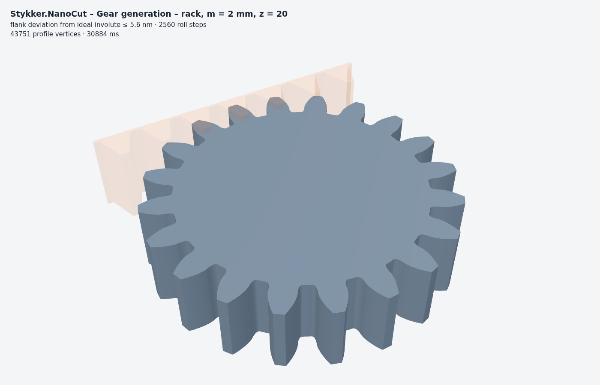
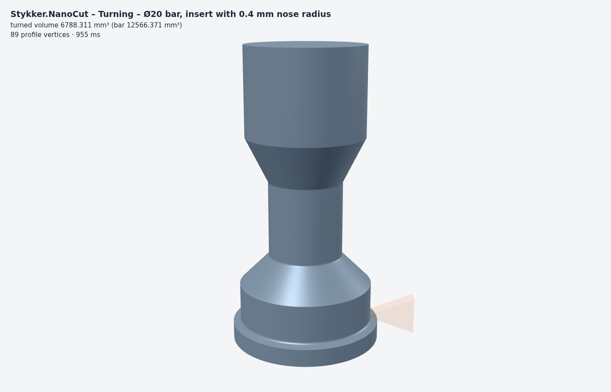
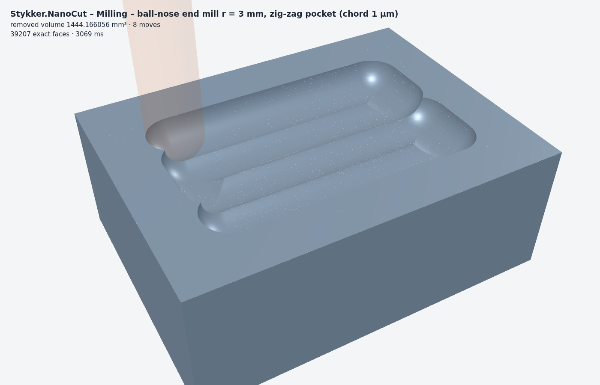

# Shape generator and processes

Every machining process is modelled the same way: **an acting shape moves relative to one or more workpieces and
removes everything it sweeps.** Only the relative motion matters, so a moving workpiece (lathe spindle, gear blank,
rotary table) is handled with `Motion2.Relative` / `Motion3.Relative` (workpiece(t)⁻¹ ∘ tool(t)).

## Shapes

| Generator | Result |
| --- | --- |
| `Region2.Rectangle/Circle/Polygon`, Booleans, `Offset` | any planar region (holes allowed) |
| `GearProfile.Involute(m, z, α)` | involute spur gear profile |
| `GearProfile.Rack(m, n, α)` | rack cutter for generating gears |
| `Region2.ConvexParts()` | exact convex decomposition (triangulation + Hertel–Mehlhorn) |
| `Solid.Box/Sphere/Cylinder/Cone/Capsule` | primitives with controlled chord error |
| `Solid.Extrude(region, z0, z1, placement)` | prism of any region |
| `Solid.Revolve(profile, tol, placement)` | solid of revolution of any r–z profile |
| `Solid.Transform(pose)` | rigid placement (rounded to the grid, ≤ 0.87 nm) |
| `ConvexHull3.Compute`, `Sweep3.Translate` | exact convex hull, exact translational sweep |
| `ToolShape.Revolved/BallNoseMill/Extruded/FromConvexParts` | acting 3D shapes as unions of convex parts |
| `ToolShape.SawBlade`, `ToolShape.SawBladeTeeth` | circular saw blade: core disc + one convex trapezoid prism per tooth |
| `SpinningTool.Disc/Symmetric/SawBlade/Prismatic/Toothed/Asymmetric` | tools spinning about their z-axis at a given rpm (see below) |
| `GrindingWheel.Random/FromGrains` | grinding wheel with discrete abrasive grains (see below) |

## Motions

`Motion2` / `Motion3` are lists of continuous segments `t ∈ [0, 1] → Pose`. Built-ins: `Linear`, `Polyline`,
`Rotate`, `Custom`, `Sequence`, `Compose` (3D), `Relative`. A segment boundary may jump (e.g. a periodic rack shifted
back by one pitch); the sweep is never interpolated across it.

## Process engines

| Engine | Use | Method | Error |
| --- | --- | --- | --- |
| `Process2` | planar processes: gear generation/shaping, wire EDM, 2.5D | convex parts at every sampled pose + the area swept by each edge between poses; edges are split where they fold (the edge point nearest the rotation centre moves along the edge) | deviation ≤ `SweepNm` (verified against a densely sampled true motion) |
| `Lathe` | turning | `Process2` in the r–z half-plane, then `Solid.Revolve` | as `Process2` + chord error of the revolve; helical feed marks not modelled |
| `Process3` | arbitrary spatial motion | parts are placed as the exact convex hull of their rotated, rounded vertices (cached); same orientation: exact Minkowski sum with the move; with rotation: convex hull of both poses with step ≤ 2·`SweepNm`/diameter | exact for translations (up to the ≤ 0.87 nm placement rounding) |

| `Process3.CutSpinning` | spinning tools (wheels, cut-off discs, saw blades) | body: feed only; prismatic teeth fed in their plane: `Process2` edge sweep of feed + spin, extruded; otherwise `Process3` on feed ∘ spin | body exact (+ chord error); teeth ≤ `SweepNm` |

Sampling is adaptive: an interval is accepted when no tool point leaves the chord between the interval's poses by more
than `Tolerance.SweepNm` (checked at the extreme points of the tool, where the deviation of a rigid motion is largest).

## Spinning tools

`SpinningTool` describes a tool that spins about its own z-axis at `Rpm` while its frame is moved along a feed
`Motion3`. Time is explicit: each feed segment gets a duration (`SpinningTool.Durations(feed, mm/s)` from a constant feed
speed, or given directly), the spindle angle is `2π · rpm / 60 · t`, and `Process3.CutSpinning(..., startSeconds)` keeps
the spindle phase across cuts that are split into several calls (e.g. frames for playback).

```csharp
var saw  = SpinningTool.SawBlade(radiusMm: 20, thicknessMm: 1.6, teeth: 12, toothHeightMm: 2.5, rpm: 3000, tol);
var feed = Motion3.Compose(Motion3.Linear(Vec3.Mm(-11, 0, 17), Vec3.Mm(-5, 0, 17)),      // feed along x …
                           Motion3.Fixed(Pose3.Rotation(-Math.PI / 2, 1, 0, 0)));         // … spindle axis along y
var rest = Process3.CutSpinning([block], saw, feed, feedMmPerS: 60, tol, out var stats)[0];
double fz = saw.FeedPerToothMm(60);                                                       // 60 / (50 · 12) = 0.1 mm
```

**Rotationally symmetric tools are spin-invariant.** Spinning maps a solid of revolution onto itself, so at every
instant it occupies the same space whatever its spindle angle; the swept volume is that of the non-spinning body
moved by the feed. A plain grinding wheel or cut-off disc (`SpinningTool.Disc`, `SpinningTool.Symmetric`) is therefore
never sampled in time: it is cut with `Process3.Cut` on the feed alone, which is one exact Minkowski sweep per straight
feed segment and independent of the rpm. The only deviation is the chord error of the inscribed polygon
(`Tolerance.ChordNm`); a rotating polygon would sweep its circumcircle instead. The test `SymmetricDiscIsSpinInvariant`
checks this against an explicitly sampled spin.

**Toothed tools** (`SpinningTool.SawBlade`, `Prismatic`, `Toothed`, `Asymmetric`) are split into a symmetric body
(e.g. the core disc, cut as above) and the cutters (teeth), whose motion is feed(t) ∘ spin(t). The material each tooth
removes, and the uncut sliver of about one feed per tooth f_z = v_f ÷ (n · z) at the end of a cut, follow from the
geometry. Two engines:

- *Planar* (default when it applies): prismatic cutters (`CutterPrism`, e.g. straight saw teeth) fed in their own plane
  (spindle axis fixed, no feed along it – sawing, slitting, cut-off). Then the swept volume is the swept *area* of the
  tooth profile extruded over the tooth thickness. The area comes from `Process2`'s exact edge sweep of feed + spin
  (pieces outside the workpiece bounds are dropped, the rest united in a tree of small groups), the prism is subtracted
  once per call. Steps per revolution: at least 63 (0.1 rad), more when the tooth tips' chord error √(8 · SweepNm / r)
  requires it. Error ≤ `SweepNm` (undercut of the tip trochoids).
- *Spatial* (any other cutters or feed, or `planar: false`): `Process3` on the combined motion, split into pieces of ≤ 45°
  of spindle rotation so that whole revolutions cannot cancel. Each step is the convex hull of a tooth at two poses with
  a step ≤ 2 · `SweepNm` ÷ tooth diameter; hulls outside the workpiece bounds are skipped and the rest united in groups
  of 64. This works for tilted blades, feeds along the axis and non-prismatic teeth, but it is 10–100× slower.

Measured (net10.0, one core; browser = Blazor interpreter without AOT; times vary ± 50 % with machine load):

| Case | Result | Time |
| --- | --- | --- |
| Ø40 × 1.6 mm wheel, 3 mm deep, 8 mm feed in 16 frames, chord 20 µm | spin-invariant, exact sweep | 0.3 s |
| Ø40 saw, 12 teeth, 3000 rpm, f_z 0.1 mm, 6 mm feed (5 rev) in 12 frames, sweep 50 µm (demo default) | planar, 396 steps | 1.2 s native, 5.5 s browser |
| same, f_z 0.05 mm, 8 mm feed (13 rev) in 16 frames, sweep 20 µm | planar, 1808 steps | 2–4 s native, 51 s browser |
| same, spatial engine, sweep 100 µm, 6 mm feed in 12 frames | 1 100 hulls | 11 s (77 s at f_z 0.05 mm) |
| Ø20 saw, 6 teeth, 3 mm feed: f_z 1 / 0.2 / 0.05 mm vs. plain disc | uncut sliver 0.256 / 0.063 / 0.014 mm³ (≈ 0.26 mm² · f_z) | 0.2 / 0.8 / 2.3 s |

Limits: the spindle speed is constant and the tool is rigid (no run-out, deflection or wear); the teeth are not set
(use `toothThicknessMm` for a wider kerf); the planar engine requires a feed exactly in the tool plane (checked at 17
points per segment, otherwise the spatial engine is used).

## Grinding with individual grains

`GrindingWheel` is a non-cutting bond (radius, width) carrying abrasive grains. `GrindingWheel.Random(radius, width,
count, grainSize, protrusionMean, protrusionSigma, rpm, seed)` places them at uniform random angles and axial positions,
with a uniformly random orientation and a protrusion drawn from a normal distribution (clamped to [0, grain size]); the
same seed always gives the same wheel. Each grain is a small octahedron (convex, grid vertices) whose outermost vertex
(the tip) lies exactly on bond radius + protrusion. `GrindingWheel.FromGrains` places grains explicitly.

`GrindingSimulation` moves every grain on its own trochoid, pose(t) = feed(t) ∘ spin(t):

1. **Planning:** the grain's bounding sphere is sampled at ≤ 0.25° of spindle rotation; every interval in which it is
   inside the workpiece's bounding box becomes a *pass*. Grains that never get near the workpiece cost nothing.
2. **Cutting:** all passes of all grains are cut in time order with `Process3` (convex hulls of consecutive grain poses,
   step ≤ 2 · `SweepNm` ÷ grain diameter – a few dozen hulls per pass because the grain is tiny). A grain therefore only
   removes what the grains before it left: the removed volume of a pass is the grain's chip.
3. **Measurement per pass:** removed volume; the largest depth of the grain tip below the surface it meets (sampled
   48 times along the pass on the workpiece before the pass) as undeformed chip thickness h_cu; the contact angles
   (radial direction from −z towards +x) where the tip is in material. Per grain: passes, active passes, total volume,
   max h_cu, angle range; overall: active grains and their ratio.
4. **Workpiece cells:** the workpiece is split into a grid of cells in x and y (default twice the grain size), so a pass
   only touches the cells under its path. `Cells` holds them, `Workpiece` unites them on demand, `VolumeMm3` sums them.

`SurfaceProfile` samples the top surface (largest z on a vertical line, from the exact face planes) along a line, e.g. a
section perpendicular to the feed, and `SurfaceProfile.Roughness` returns Ra (mean absolute deviation from the mean line)
and Rz (peak to valley over the whole line – one sampling length, not the five-length average of ISO 4287).

```csharp
var wheel = GrindingWheel.Random(radiusMm: 10, widthMm: 1, grainCount: 60, grainSizeMm: 0.15,
                                 protrusionMeanMm: 0.04, protrusionSigmaMm: 0.015, rpm: 3000, seed: 1);
var sim = new GrindingSimulation(block, wheel, feed, SpinningTool.Durations(feed, 20), Tolerance.Budget(2.1, 50, 2000));
sim.Run();                                                       // or AdvanceTo(t) frame by frame
var (ra, rz) = SurfaceProfile.Roughness(new SurfaceProfile(sim.Cells).Line(0.4, -0.4, 0.4, 0.4, 301));
```

Checks (tests/GrindingTests.cs): a single grain with protrusion p under a bond c above the surface cuts a scratch whose
lowest point is p − c within 1 nm (20.0000 µm), with h_cu = 19.9995 µm and contact angles ±5° (√(2 · 0.02 / 5) rad);
grains short of the surface stay inactive; a seed reproduces wheel and result exactly.

Measured (demo default: Ø20 × 1 mm wheel, 60 grains of 150 µm, protrusion 40 ± 15 µm, 3000 rpm, 20 mm/s, 0.8 mm feed,
path error 2 µm): 118 passes, 80 of them cutting, 42 of 60 grains active, Ra 9.7 µm, Rz 55 µm; 1.6 s native, 15 s in the
browser without AOT. 100 grains over 2 mm feed (380 passes): 2.4–4 s native. The cost per pass (≈ 6–10 ms native) is the
Boolean of a handful of hulls with the cells under it; finer path errors add hulls and faces.

Limits: grains are rigid octahedra (no fracture, wear or ploughing / elastic deflection), the bond never cuts, chips are
geometric (undeformed); h_cu is sampled along the tip path, not integrated over the whole grain.

## Measured (net10.0, one core)

| Process | Result | Time |
| --- | --- | --- |
| Gear generation with a rack, m = 2 mm, z = 20, sweep 30 nm | flank deviation from the ideal involute ≤ 5.6 nm (5.4 nm measured), 2560 roll steps, 209 089 swept pieces, 69 contours | 41 s |
| Same, sweep 300 nm | ≤ 20 nm (20.1 nm measured), 640 roll steps, 104 560 pieces | 9 s |
| Turning a Ø20 × 40 mm bar, 8 moves | 89 profile vertices | 1 s |
| Ball-nose pocket, 8 moves, chord 1 µm | 39 207 faces | 3 s |
| Same, chord 50 nm | 664 246 faces | 51 s |





## Independent verification

An independent review with adversarial tests (`tests/Stykker.NanoCut.Tests/VerificationTests.cs`) found and pinned
three bugs, all fixed:

1. The floating-point filter assumed relative errors only; the fragment probe point is an average of large
   coordinates and can carry a larger absolute error (cancellation). The probe now carries an absolute error bound
   that the filters include.
2. A tilted tool moved straight left the workpiece open: rounding the rotated tool to the grid creates nm dents, and
   the translational sweep requires convexity. Parts are now placed as the exact convex hull of their rounded
   vertices (new quickhull with conflict lists: 380 000 vertices in ~8 s).
3. The planar edge sweep missed the bulge where a rotating edge folds (195 nm undercut against 30 nm allowed); edges
   are now split across the fold range (11.9 nm in the same case).

## Performance notes (measured)

### The gear case: where the 41 s go

`Process2.Cut` on the rack case (m = 2 mm, z = 20, `Tolerance.Default`) is the slowest planar process, so it was
measured phase by phase. 2560 roll steps, 209 089 swept pieces, result 1231.252941475 mm² in 69 contours, flank
deviation 5.4 nm from the ideal involute (the same metric the test asserts at ≤ 5.6 nm):

| Phase | Time | What it is |
| --- | ---: | --- |
| `SweepPieces` | 0.4 s | the 209 089 convex pieces |
| bounds filter | 0.01 s | `Overlaps` against the workpiece box |
| 80 `UnionAll` calls over the pose parts | 17.7 s | 32 near-congruent 3687 mm² copies of the 8-part rack per batch, 0.76 ms per piece |
| 621 subtracts of the growing result | 23 s | growing with the loop count of the result |
| **total** | **41.0 s** | 69 contours, 5.4 nm |

The total is `Process2.Cut`'s own figure, 40.98 s in the run the phases come from. That run reports no separate
subtract figure, so the subtract in the table is the remainder after the measured sweep, bounds filter and unions:
0.4 + 0.01 + 17.7 + 23 = 41.1 s is the call's own 40.98 s to the rounding of the parts. That is how the shipped row
is checked, and how an earlier draft of this section was found to be wrong, having carried a total of 32.1 s that its
own phases contradicted by nine seconds. The interval-order row below is built the other way round: there union and
subtract are timed separately (2.20 + 51.40 s) and leave about 4 s of the 57.87 s call uncovered. Compare totals
across rows, not parts within a row.

Two costs, with opposite behaviour. `UnionAll` is superlinear in the number of *overlapping near-congruent* polygons
— the exact kernel is single-threaded and has to merge every one of those rack copies with the others — so a batch of
256 pose parts costs 0.76 ms per piece against 0.011 ms for a batch of edge-sweep bands. The subtract is the other way
round: it costs what the *result's* loop count costs, and every batch leaves its slivers behind in it.

That is why the shipped piece order (all pose parts first, then the bands) is the right one, and why the obvious
"unite neighbouring intervals instead of neighbouring poses" is a trap. Every variant was built and timed:

| Variant | Union | Subtract | Total | Result contours | Flank |
| --- | ---: | ---: | ---: | ---: | ---: |
| **shipped order, batches of 256** | 17.7 s | 23 s | **41.0 s** | **69** | 5.4 nm |
| interval order, batches of 256 | 2.2–2.5 s | 47–52 s | 57.9 s | 1151–2013 | exact |
| interval order, batches of 1024 | 11.6 s | 22.9 s | 34.5 s | 3946 | exact |
| interval order, batches overlapping by 32 pieces | | | 44.2 s | 1554 | exact |
| interval order, batches overlapping by 64 pieces | | | 32.7 s | 3459 | exact |
| one union for all 209 089 pieces | does not finish in 9 min | | | | |
| coarser fold split (2 instead of 4 sub-intervals) | | | 49.5 s | | 33 067 nm |
| finer fold split (hoist the fold point) | | 188 769 → 150 033 pieces, no win in time | | | exact |
| pose parts dropped, bands only | | | | | 205 614 nm |

Reading the table:

- **Reordering makes the union 7× cheaper and the subtract 2× more expensive**, because a batch that is no longer one
  contiguous ribbon subtracts as a set of slivers and leaves degenerate loops in the result. The 16 % win at batch 1024
  costs 57× more contours, and the result stays that way for every later batch.
- **The pose parts are load-bearing, not redundancy.** The Minkowski identity (a convex polygon plus a translation is
  the union of the edge trapezoids) holds for translations only; under a rotation the pose parts are what covers the
  concave side of the fold. Dropping them keeps the area right to nine decimals and costs 206 µm of flank error —
  40 000× the tolerance — which is the dangerous kind of failure, because a check that only compares areas passes.
- **The fold split cannot be tuned into a win.** Coarser loses the flank by five orders of magnitude; finer changes
  nothing, because the fold point is essentially stationary over a 30 nm step and there is less of the edge to split.

**Conclusion: the shipped order is a local optimum, and the win has to come from the grouping, not the order or the
batch size.** The change worth making is to group the swept pieces by the region of the workpiece they remove, so each
batch is one contiguous ribbon and each subtract sees a result whose loop count stays near 69. That is a change to how
`Process2.Cut` batches, not to the sweep, and it is listed in `docs/todo.md`.

The one change that survived from this investigation is the bounds filter: it runs on every piece of every sweep, and
the four LINQ passes over the vertices became a single pass (0.01 s of 41.0 s — kept because it is strictly less work,
not because it moved the needle).

### Other processes

Cube 8 mm moving and turning through a 20 mm cube, path error 50 µm (128 steps per 45°):

| Step | before | now native | now browser (AOT) |
| --- | --- | --- | --- |
| first 45° rotation (A) | 12 s native, 32 s AOT | 0.46 s | 0.6 s |
| translation on the cut cube (Y) | 5.3 s native, 15 s AOT | 0.55 s | 2.6 s |
| second 45° rotation (C, around the tilted cube) | 45 s native, 114 s AOT | 5.6 s | 17.5 s |

What made the difference:

1. **Floating-point filters** for every side test and every ray–face test: the sign is taken from a double
   evaluation when it clearly exceeds a conservative rounding bound (1e-11 × Σ|terms|, about 10⁴ above the actual
   error), otherwise the Int384 / BigInteger evaluation decides. Results are unchanged (all tests, including the
   degenerate lattice fuzzing and the ManifoldSharp oracle, pass); the exact path now runs for < 1 % of the tests.
2. **Coplanar knowledge in the ray cast:** faces in the fragment's own plane are skipped without arithmetic, and the
   coplanar-overlap test no longer builds the exact interior point.
3. **Split tree and fragment merging:** pieces of a face are restored when they all end up on the same side, and
   coplanar neighbours sharing an edge are merged when their union is convex (exact edge planes are kept).
4. **Grouped sweeps:** neighbouring swept pieces are united in groups of eight before cutting the workpiece.

The remaining cost of long rotating sweeps is the face count (35 000 faces after the second rotation above): regions
bounded by a polygonal envelope need many convex pieces, and pieces meeting at T-junctions cannot be merged yet.

## Known limits / next steps

- **3D motions with rotation** (5-axis tool tilt, hobbing, skiving, rotating workpiece in 3D) use the convex hull of
  two poses, which needs very small steps. An exact face-sweep (analogous to the 2D edge sweep) is the next step.
- **Face count:** pieces are merged back (split tree, coplanar merging), but pieces meeting at T-junctions are not,
  so long rotating sweeps still accumulate many faces.
- **Spinning tools in 3D:** toothed tools fed out of their plane use convex hulls of the rotating teeth (slow); the
  planar edge sweep covers sawing and slitting in the blade plane.
- **Turning feed marks:** the lathe model is a continuous cut; scallops of the feed per revolution are ignored.
