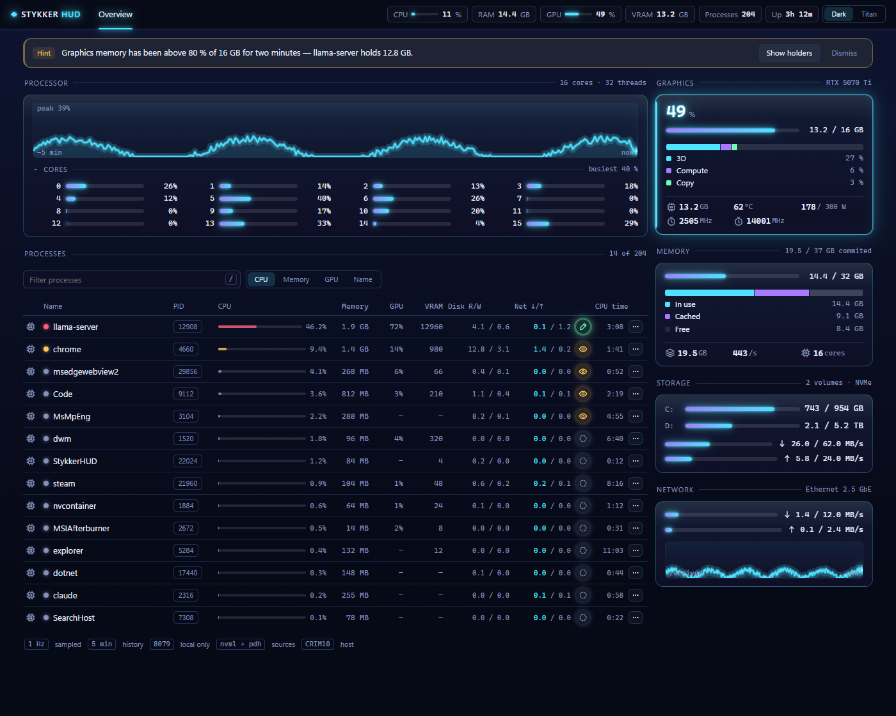
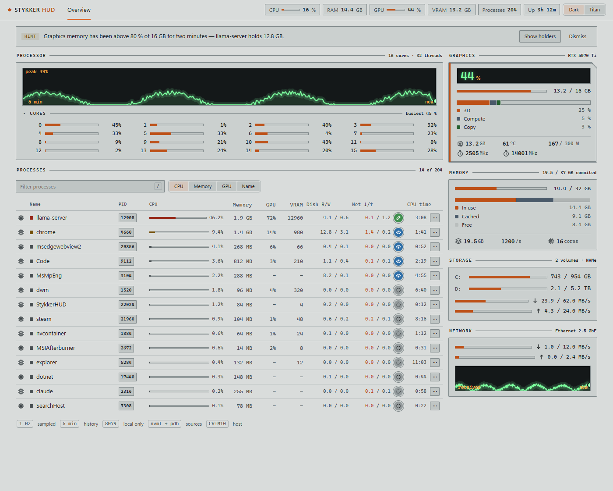
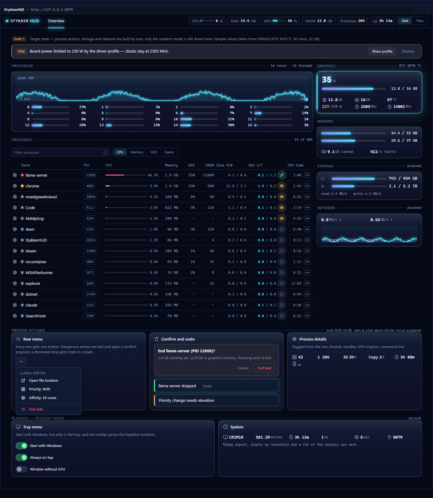

# StykkerHUD — das Gerüst steht (2026-10-08)

Ein Ressourcenmonitor für diese Maschine: Prozesse, GPU, CPU, Speicher. Aufgebaut auf dem
**gemeinsamen Design-System der Stykker-Familie** (aus `C:\_AI\Stykker\MonoRepo\shared\design-system`), mit den
beiden Themen **Dark** und **Spacepunk Titan**.

## Was läuft

Vier Projekte, `dotnet build StykkerHud.slnx -c Debug` ist sauber (0 Warnungen, 0 Fehler):

| Projekt | Rolle |
|---|---|
| `StykkerHud.Core` | Modell, Messschleife (1 s), Verlauf über 5 Minuten. Kennt kein Betriebssystem. |
| `StykkerHud.Platform.Windows` | CPU/RAM, GPU (`nvml.dll`), GPU je Prozess (PDH), Tray-Symbol. Jeder Teil ist verzichtbar → Anzeige zeigt „–". |
| `StykkerHud.Server` | Blazor Server auf `http://127.0.0.1:8079`, nur lokal, mit Tray. `/`, `/api/snapshot` und die drei Prozesstüren. |
| `StykkerHud.UI` | `StykkerHUD.exe` — Photino-Fenster (WebView2) um genau diese Seiten. |

Die Messschleife liegt **im Dienst, nicht in der Seite** – und sie liest nur, solange jemand zusieht: der
erste Abruf wirft sie an, 15 Sekunden ohne Abruf halten sie wieder an. Die Seite fragt nur, wenn sie
sichtbar ist; ein geschlossenes **oder verborgenes** Fenster kostet also nichts. Der Server startet davon
unabhängig sofort (gemessen: Port nach **638 ms** offen, erste Antwort auf `/` nach **764 ms** – ohne eine
einzige Messung). Die Kurven zeichnet der Browser, nicht Blazor.

## Gemessen (verifiziert, `docs/hud-measure.json`)

- Kopfzeile mit echten Werten: CPU, RAM 14,4/31,9 GB, GPU 3 %, VRAM 1,6 GB, 205 Prozesse, Laufzeit.
- GPU: **RTX 5070 Ti**, 1,6/15,9 GB VRAM, 28 °C, 40 W von 300 W, 2557 MHz — über NVML, ohne `nvidia-smi`-Prozess.
- Prozessliste: 40 Zeilen aus 205, GPU-Anteil **und** VRAM je Prozess aus den Windows-Leistungsindikatoren
  (dieselben Zahlen wie der Task-Manager).
- 16 Kern-Balken, CPU-Kurve mit „peak 28 %", kein horizontaler Überlauf (Raster 976 px + 340 px Rail).
- Farben und Schriften kommen aus dem Design-System: Grund `#060916`, Akzent `#4fe3ff`, Cascadia Mono für Zahlen.
- Titan-Thema messbar anders: Grund `#d9dcdb`, Akzent `#bd5017`, Radius 2 px.
- Keine Konsolenfehler. Fenster startet, WebView2 kommt hoch (Photino-Absturz nicht aufgetreten).
- **Durchsatz als Balken** (neu): Datenträger 10,6/23,8 MB/s lesen, 26,1 MB/s schreiben; Netzwerk 6 KB/s
  empfangen, 2 KB/s senden — jeder Balken am Sockel der Sitzung, daneben steht „Wert / Sockel".
- **Kerne zugeklappt** (neu): die Zeile nennt „busiest 53 %", ein Klick öffnet 16 Kern-Zeilen. 14 von 14
  Verhaltensprüfungen grün mit `node tools\check-ui.mjs --port 8079`.
- **Nur bei sichtbarer Seite** (neu): Verlauf 1 → 4 nach drei Sekunden Messen → nach 20 Sekunden ohne Abruf
  wieder 1, denn die Schleife hatte angehalten und der Verlauf begann neu.
- **Prozess-Aktionen** (neu): beenden, Priorität, Ordner öffnen — **16 von 16 Prüfungen grün** mit
  `node tools\check-actions.mjs --port 8079`, an einem Opferprozess, den die Prüfung selbst startet und beendet:
  Priorität steht danach wirklich auf High, die Rückfrage schützt, „Cancel" tut nichts, erst die Bestätigung
  beendet, und der Toast nennt das Ergebnis samt PID. Die Sperren greifen ebenfalls: fremde Herkunft 403,
  Anfrage ohne JSON 415, System-PID abgelehnt.
- **Gruppierung nach Name und Pfad** (neu): zwei `PING.EXE` aus derselben Datei ergeben **eine** Zeile `×2`
  mit summiertem Speicher (11 MB) und 12 Threads; eine Suche klappt sie auf, der Winkel klappt sie wieder zu,
  und „End all 2 tasks" beendet beide erst nach der Rückfrage (Toast: „2 of 2 done."). **16 von 16 Prüfungen
  grün** mit `node tools\check-groups.mjs --port 8079`. Die älteren Prüfungen laufen unverändert: 14/14
  (`check-ui`) und 16/16 (`check-actions`).

Bilder: `docs/hud-dark.jpg`, `docs/hud-titan.jpg`, `docs/hud-review.jpg`.
Nachprüfen: `node tools\shot.mjs --port 8079 --out docs`, `node tools\check-ui.mjs --port 8079`,
`node tools\check-actions.mjs --port 8079` und `node tools\check-groups.mjs --port 8079`.

## Entscheidungen

- **Design-System wird geliefert, nicht kopiert.** Der Server liest es zur Laufzeit unter `/ds` aus
  `C:\_AI\Stykker\MonoRepo\shared\design-system` (`--design-system <Ordner>` ändert das). Eine Änderung dort wirkt
  beim nächsten Laden — genau eine Fassung für die Familie. Der Weg über `Content` + `Link` im Projekt
  funktioniert nicht: solche Dateien landen im Entwicklungsbetrieb nicht im Static-Web-Assets-Manifest.
- **Design-System erweitert (2026-10-08):** drei Symbole, die dem Satz fehlten — `i-arrow-up`,
  `i-arrow-down` (Übertragungsrichtung, für Netzwerk und Datenträger lesen/schreiben) und `i-disk`
  (das Laufwerk selbst). Sie liegen im gemeinsamen Ordner (`assets/Icons/*.svg`, Sprite in
  `components/bundle.js`, Liste in `assets/Icons/README.md`), also sieht StykkerLLM sie ebenfalls.
  Achtung: `i-down` und `i-peak` sind **Trend**-Zeichen (Linie mit Knie), keine Richtungspfeile.
- **Fenster zeichnet ohne Grafikkarte** (`--gpu` schaltet um): ein Monitor soll die GPU messen, nicht benutzen.
- **Nur 127.0.0.1**: ein Ressourcenmonitor hat im Netz nichts zu suchen. Kein Zugangscode nötig.
- **Gemessen wird nur bei sichtbarem Fenster:** erster Abruf startet die Schleife, 15 s ohne Abruf halten sie
  an, und die Seite fragt nur bei sichtbarer Seite (`document.hidden`). Die Differenz-Zähler (CPU-Zeiten,
  Durchsatz-Raten) werden beim Wiederanfang neu gesetzt, sonst wäre der erste Wert über die ganze Pause
  gemittelt – deshalb beginnt der Verlauf nach einer Pause neu statt eine Lücke zu verschweigen.
- **Kein Blazor-Kreis für die Live-Werte**: Seite einmal statisch gerendert, Zahlen per `fetch` im Sekundentakt.
- **Prozess-Aktionen sind eingezäunt:** nur `127.0.0.1`, nur die eigene Seite (`Origin` beziehungsweise
  `Sec-Fetch-Site`, sonst 403), nur JSON (sonst 415), PID ≤ 4 und der Server selbst bleiben unangetastet,
  „End task" fragt zuerst, und **RealTime fehlt absichtlich** — damit lässt sich die Maschine lahmlegen.
  Aus der Oberfläche lässt sich kein ganzer Prozessbaum beenden: die API kennt `tree: true`, niemand ruft es.
- **Gruppiert wird nach Name *und* Pfad**, nicht nur nach Name: zwei verschiedene Programme mit gleichem Namen
  bleiben getrennt. Den Pfad liefert `QueryFullProcessImageNameW` über den Prozessgriff — billiger als
  `Process.MainModule` und auch für 32-Bit- und geschützte Prozesse vorhanden (gemessen: 218 von 218 Prozessen,
  Mittel 52 ms je Abruf). Die Gruppenzeile summiert CPU, Speicher, GPU, VRAM und Threads; die Priorität steht
  dort **nicht**, weil sie sich zwischen den Mitgliedern unterscheiden kann.

## So soll die App aussehen — `docs/design/mockup-2.html`

Ein Mockup ist in dieser Familie eine eigenständige HTML-Seite. `mockup-2.html` ist die App als reine
Oberfläche: keine Anmerkungen, keine Etiketten — der fertige Bildschirm. Er trägt **dieselben
Element-Kennungen** wie die laufende Seite, damit Entwurf und gebaute Fassung mit demselben Befehl
gemessen werden können. Zahlen und Kurven sind erfunden, geformt nach den Messwerten dieser Maschine;
alles andere kommt aus dem verlinkten Design-System, damit der Entwurf nicht driftet.



*Kopfzeile (CPU, RAM, GPU, VRAM, Prozesse, Laufzeit) mit dem Umschalter Dark/Titan; Hinweisleiste;
Prozessorkarte mit der Fünf-Minuten-Kurve und 16 Kern-Balken; Prozesstabelle mit CPU, Speicher, GPU-Anteil,
VRAM, Datenträger- und Netzraten, Zustandszeichen und Zeilenmenü (`⋯`); rechts Grafikkarte mit der
Engine-Aufteilung, der Speicher als Zusammensetzung (belegt / gecacht / frei), die Laufwerke mit Lese- und
Schreibbalken und eine Netzwerk-Kurve mit Empfangs- und Sendebalken; unten eine Fußzeile mit Takt, Verlauf,
Port und Quellen. Die Kern-Balken liegen hinter einer zugeklappten Zeile, die den vollsten Kern nennt.*

Derselbe Bildschirm in **Spacepunk Titan**:



`docs/design/mockup-1.html` ist der kommentierte Arbeitsentwurf daneben: derselbe Bildschirm plus das Tray-Menü
mit den Schaltern für den Dauerbetrieb (fehlt noch) und die Prozess-Aktionen (seit 2026-10-08 gebaut — als
**Bestätigungsleiste über der Liste** statt als Popover, das dieser Entwurf gezeichnet hatte).



Bilder neu erzeugen (beide Themen; `-full.png` zeigt die ganze Seite, `-review.jpg` ist ein kleines Bild
für die Bildprüfung):

```powershell
node tools\shot.mjs --url file:///C:/_AI/Stykker/MonoRepo/hud/docs/design/mockup-2.html --out docs\screenshots --name mockup-2 --format png --height 1120
node tools\shot.mjs --url file:///C:/_AI/Stykker/MonoRepo/hud/docs/design/mockup-1.html --out docs\screenshots --name mockup-1 --format png
```

`docs/design/mockup-2-onepager.html` ist derselbe Entwurf als **eigenständige** Seite: das Design-System ist
eingebettet statt verlinkt, sie braucht also keine anderen Dateien und lässt sich als Artefakt
veröffentlichen. Neu erzeugen: `node tools\onepager.mjs`.

## Offen (Vorschlag für die nächsten Schritte)

1. **Zugehörigkeit (Affinität)** und das Beenden eines ganzen Prozessbaums aus der Oberfläche — die API kennt
   `tree: true`, es gibt nur noch keinen Knopf dafür.
2. **Durchsatz je Laufwerk und je Adapter** (heute ist es die Summe über alle Laufwerke und Adapter).
3. **Dauerbetrieb** — Autostart und nur im Tray.
4. **Eigenes Programm-Symbol** (`.ico`) und die drei Symbole, die dem Design-System noch fehlen:
   Temperatur, Leistung, Lüfter — diese Werte tragen nur einen `title` statt eines Zeichens.