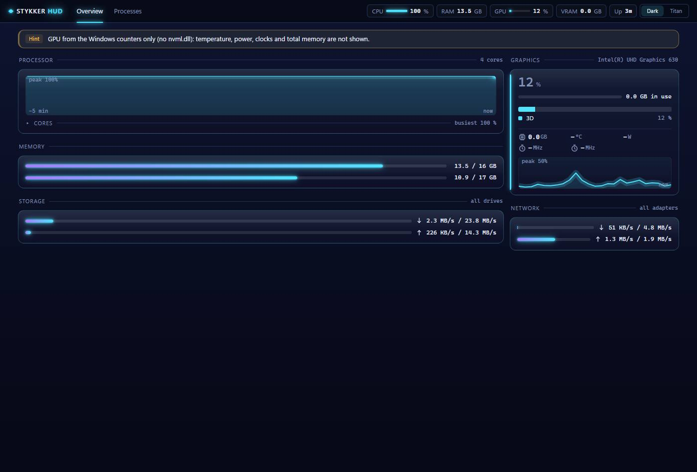
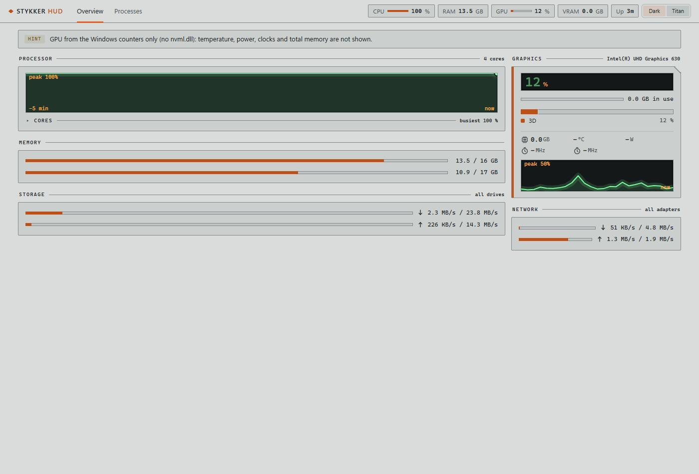

# StykkerHUD

Live monitor for this machine: processor, memory, graphics, storage and network. Part of the Stykker suite, built on the shared design system in [`shared/design-system`](../shared/design-system/): the same tokens, components and two themes (*Dark*, *Spacepunk Titan*).

The process list is no longer part of this tool. It lives in [StykkerSYS](../sys/README.md), which the **Processes** tab opens on port 8077.





The interface is an instrument panel, not a table dump: every figure is monospaced with tabular digits, each state carries a symbol beside its colour, and the curves move only when the data moves.

## What it shows

- **Processor**: total load, the five-minute curve, and every core behind a **folded line**. Folded, it names the busiest core; one click opens the bars, which are only built while open.
- **Memory**: used and total RAM, and the commit charge.
- **Graphics**: utilisation, VRAM, temperature, board power against its limit, graphics and memory clock (NVIDIA through `nvml.dll`), and the split of the load across the engines (3D, Compute, Copy, Video decode, Video encode) as a stacked bar with a legend. Without `nvml.dll` (Intel or AMD graphics) the utilisation, the engine split and the memory in use come from the Windows GPU counters; temperature, power, clocks and total memory then show `–`.
- **Storage and network**: read/write and received/sent as **bars**. Each row shows the value against the peak of the session (`10.6 MB/s / 23.8 MB/s`). Totals over all physical drives and all active adapters.

## Layout

| Path | What it is |
|---|---|
| `src/StykkerHud.Core/` | The model (`Samples.cs`), the sampler (`MetricsSampler`) and the service (`HudService`, a viewer loop from `shared/`). Knows no operating system. |
| `src/StykkerHud.Platform.Windows/` | The Windows side: CPU and memory (`kernel32`, `ntdll`), GPU (`nvml.dll`), disk throughput (`pdh.dll`), network counters. Every part is optional: when one is missing its value shows `–`. |
| `src/StykkerHud.Server/` | Blazor Server on `http://127.0.0.1:8079`, local only, with a tray icon. Serves the page and `/api/snapshot`. |
| `src/StykkerHud.UI/` | `StykkerHUD.exe`, the Photino window (WebView2) around those pages. |
| `../shared/` | `Stykker.Shared`: GPU counter queries, the PDH wrapper, tray icon, design-system hosting, the viewer loop. See [its README](../shared/README.md). |
| `tools/shot.mjs` | Measures the rendered page (values, colours, geometry, both themes) and writes the screenshots. |
| `tools/check-ui.mjs` | Behaviour checks on the running page: cores folded at first, opening them shows one row per core, the throughput bars carry widths and value/peak text, no metric cell overflows its column, the graphics card reports its engine split. |
| `tools/onepager.mjs` | Builds a standalone page from a draft by embedding the design system (for artifacts). |
| `docs/` | Screenshots, the design mockups and the open decision (`entscheidungen.md`). |

**Nothing is read while nobody looks.** The server binds its port and answers at once, before any measurement. The loop starts with the first `/api/snapshot` request and stops after **15 seconds** without one. The page only asks while it is visible, so a closed or hidden window costs nothing. A restart resets the deltas (CPU times, throughput rates) and begins a **fresh curve**, because the earlier points belong to another time window. The loop lives in the service, not in the page, so every viewer sees the same reading.

## Build and run

```powershell
dotnet build StykkerHud.slnx -c Debug

# window (starts the server itself if none runs)
src\StykkerHud.UI\bin\Debug\net10.0\StykkerHUD.exe

# server alone, in the browser
src\StykkerHud.Server\bin\Debug\net10.0\StykkerHUD-Server.exe --port 8079
```

| Switch | Effect |
|---|---|
| `--port <number>` | web port (default 8079) |
| `--no-tray` / `--no-browser` | no tray icon / do not open a browser |
| `--basic` | no system access: every value shows `–` |
| `--design-system <folder>` | where the design system is read from (see below) |
| `--server <path>` (window) | the server to start when none runs; by default it is found next to the window or in the build tree |
| `--gpu` (window) | draw through the graphics card. Without it the window draws in software, so the monitor does not use the GPU it measures |

## The design system is one source, not a copy

The styles are not copied into this repository. The server serves them at `/ds` straight from `shared/design-system` in the monorepo (default `C:\_AI\Stykker\MonoRepo\shared\design-system`), so a change there shows at the next reload, for the whole family. Another location: `--design-system <folder>` or the environment variable `STYKKERHUD_DESIGN_SYSTEM`.

Consumed: `tokens.css`, `components/bundle.css`, `components/bundle.js` (the icon sprite) and `assets/Logos/app-icon.png`. `wwwroot/app.css` holds only the few rules the design system does not have.

On 2026-10-08 three icons went into the shared set for this app: `i-arrow-up` and `i-arrow-down` (direction of transfer) and `i-disk` (the drive). StykkerLLM and StykkerSYS see them too. `i-down` and `i-peak` are **trend** glyphs (a line with a knee), not direction arrows.

Two layout rules to know: `.mgrid` fits its columns to the card (`repeat(auto-fit, minmax(72px, 1fr))`), and an empty `.stack` or `.legend` in the rail needs its own `[hidden]` rule in `wwwroot/app.css`, because the design system's `display` rules outrank the `hidden` attribute.

## Verifying

Needs Node.js and Google Chrome. Run `npm install` once in `tools/`.

```powershell
# screenshots and measurements of the running application (port 8079 must answer);
# --wait keeps the page open that many seconds, so the processor curve has a shape
node tools\shot.mjs --port 8079 --out docs\screenshots --name hud --wait 25

# behaviour of the running page
node tools\check-ui.mjs --port 8079
```

Each shot run writes `hud-measure.json` (DOM measurements, console problems, failed requests), the two theme pictures, a full-page PNG and a small review picture. A run that reports `problems: none` has no 404 and no console error. The DOM measurements are the check; the picture only confirms them.

Last run on 2026-10-09: `check-ui` 18/18 checks passed, no problems.

## Design mockups

`docs/design/mockup-1.html` and `mockup-2.html` are the design drafts from before the split. They still show the process table, which now belongs to StykkerSYS. They are kept as the record of the design work, not as the current screen. `mockup-2-onepager.html` is the same draft as a standalone page (design system embedded), for publishing as an artifact.

## Not built yet

- **Throughput per drive and per adapter.** Today the bars are totals over all drives and adapters.
- **Resident mode**: start with Windows and live only in the tray.
- **Own app icon** (`.ico`), and the three icons the design system still lacks (temperature, power, fan). Those values carry a `title` instead of a symbol.
- **Open decision**: Blazor/Photino or Avalonia for the interface. See [`docs/entscheidungen.md`](docs/entscheidungen.md).
